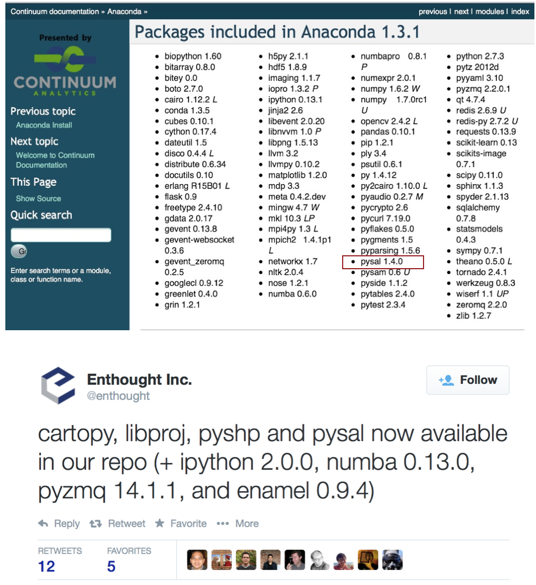
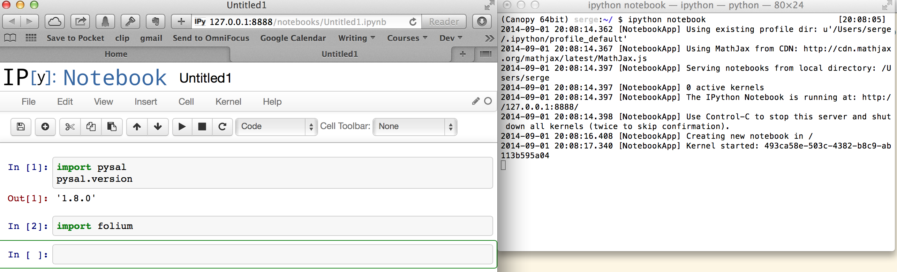

# Spatial Data Analysis with PySAL -- Sergio Rey

## Bio
[Sergio Rey][Rey] is professor of geographical sciences and core faculty member of the GeoDa Center for Geospatial Analysis and Computation at the Arizona State University. His research interests include open science, spatial and spatio-temporal data analysis, spatial econometrics, visualization, high performance geocomputation, spatial inequality dynamics, integrated multiregional modeling, and regional science. He co-founded the Python Spatial Analysis Library (PySAL) in 2007 and continues to direct the PySAL project.  Rey is a fellow of the spatial econometrics association and editor of the journal Geographical Analysis.

## Tutorial Description

[PySAL][pysal] is a modular library that supports a wide variety of spatial analysis methods. In this tutorial we will provide an introduction to a selection of these modules and  show users the methods can be used to analyze their spatial data. The focus is on: [1] the processing of different common vector formats for geospatial data; [2] the visualization and mapping of that data; and [3] the application of methods of exploratory spatial data analysis. Along the way we also demonstrate the use of PySAL with other packages in the Python scientific stack including [matplotlib][mpl], [cartopy][cartopy], and [folium][folium], as well as how PySAL can be used with the open source geographic information system [QGIS][anita]. Concepts will be illustrated through a series of IPython notebooks and participants will have the opportunity to carry out several hands-on exercises.

## Outline

- 0:00-0:15 Introduction and setup
	- PySAL Overview
	- Ensure all participants have require packages installed along with datasets and notebooks for the tutorials and exercise

- 0:15-0:45 Processing spatial data
	- Introduction to common vector based spatial data formats
	- Reading shapefiles, geojson and other data formats
	- Geoprocessing

- 0:45-1:15  Mapping and geovisualization
	- Choropleth mapping concepts
	- PySAL visualization module with matplotlib
	- PySAL + folium
	- PySAL + cartopy

- 1:15-2:15 Introduction to spatial autocorrelation analysis
	- Spatial Weights
	- Global Moran's I
	- Hypothesis Tests
	- PySAL + QGIS

- 2:15-3:00 Local spatial autocorrelation analysis 
	- Local Indicators of Spatial Association
	- Hot and cold spot detection
	- Visualization
	- PySAL + QGIS

## Prerequisites

- Previous experience with Python programming is recommended
- Participants should bring their own laptops to the workshop
- Software should be installed prior to traveling to the workshop (instructions below)

### Software Requirements

For the workshop we will require the following packages be installed

- PySAL 1.9.1
- SciPy
- Numpy
- iPython Notebook 3.0+
- folium
- [QGIS][qgisdl]

There are a number of ways to install PySAL and these dependencies. For the workshop, if you do not yet have the dependencies installed we suggest using one of two scientific Python distributions (below). These have the advantages of including most of the dependencies for PySAL as well as PySAL itself. Moreover, both allow for updating PySAL to the most recent release  (1.9.1 released January 31, 2015) which is more current that what is listed in either distribution. Both of these distributions also allow for installation of our final dependency, folium.

#### PySAL via Anaconda Python Distribution

1. Install [Anaconda Python Distribution Version 1.8.0][Anaconda]
2. Open a terminal (Mac or Linux) or Powershell (Windows)
2. `pip install -U pysal`
3. `pip install -U folium`
4. conda update ipython ipython-notebook ipython-qtconsole

#### PySAL via Enthought Canopy
Note that the Academic version of Canopy comes with PySAL version 1.7. For this workshop we will be using PySAL 1.9.1. Upgrading in Canopy can be done as follows:

1. Install [Canopy][Canopy]
2. Run Canopy
3. From the menu select `Tools Canopy Terminal`
4. `pip install -U pysal`
5. `pip install -U folium`
6. enpkg ipython

#### Testing Your Installation

Once you have installed all the dependencies, you can check to confirm everything is ready to go.

For Anaconda:

1. Open a terminal (Mac or Linux) or Powershell (Windows)
2. `ipython notebook`
3. In the browser click `New Notebook`
3. In the first cell in the notebook enter  
   `import pysal`

   `pysal.version`
   
   Then `<Shift-Enter>` (i.e., hit the Shift then the Enter Key)
4. In the second cell in the notebook enter  
   `import folium`

   Then `<Shift-Enter>`
 
Your screen should look something like:

For Enthought Canopy:

2. Run Canopy
3. From the menu select `Tools Canopy Terminal`
2. `ipython notebook`
3. In the browser click `New Notebook`
3. In the first cell in the notebook enter  
   `import pysal`

   `pysal.version`
   
   Then `<Shift-Enter>` (i.e., hit the Shift then the Enter Key)
4. In the second cell in the notebook enter  
   `import folium`

   Then `<Shift-Enter>`
 

Your screen should look something like:

#### Issues

If you run into any problems, double check that you have installed both the upgraded version of PySAL and folium (see above). If problems persist, please contact me <sjsrey@gmail.com>.

[anita]: https://twitter.com/underdarkgis/status/488788614172901376
[cartopy]: http://nbviewer.ipython.org/gist/darribas/9a0d3b6177b7ca6be007/london_boroughs.ipynb
[folium]: https://gist.github.com/sjsrey/6802208 
[mpl]:  http://nbviewer.ipython.org/gist/darribas/3890284
[pysal]: http://pysal.org
[qgisdl]: http://www2.qgis.org/en/site/forusers/download.html
[Anaconda]: http://continuum.io/downloads.html
[Canopy]: https://www.enthought.com/store
[Rey]: https://geoplan.asu.edu/people/sergio-j-rey
[VirtualBox]: https://www.virtualbox.org/wiki/Downloads
[VirtualBox 4.3.12]: http://download.virtualbox.org/virtualbox/4.3.12/VirtualBox-4.3.12-93733-Win.exe
[Vagrant]: http://www.vagrantup.com/downloads.html
[Vagrantfile]: Vagrantfile
