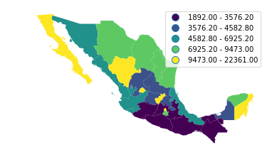
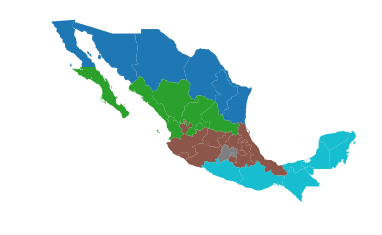
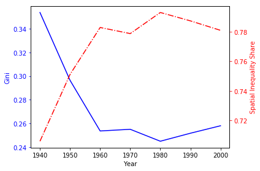

<div markdown="1" class="cell code_cell">
<div class="input_area" markdown="1">
```python
import sys
import os
import matplotlib.pyplot as plt
%pylab inline

```
</div>

<div class="output_wrapper" markdown="1">
<div class="output_subarea" markdown="1">
{:.output_stream}
```
Populating the interactive namespace from numpy and matplotlib
```
</div>
</div>
</div>


<div markdown="1" class="cell code_cell">
<div class="input_area" markdown="1">
```python
sys.path.append(os.path.abspath('..'))
from pysal.explore import inequality
import pysal.lib

```
</div>

</div>


<div markdown="1" class="cell code_cell">
<div class="input_area" markdown="1">
```python
pysal.lib.examples.available()

```
</div>

<div class="output_wrapper" markdown="1">
<div class="output_subarea" markdown="1">


{:.output_data_text}
```
['georgia',
 '__pycache__',
 'tests',
 'newHaven',
 'Polygon_Holes',
 'nat',
 'Polygon',
 '10740',
 'berlin',
 'rio_grande_do_sul',
 'sids2',
 'sacramento2',
 'burkitt',
 'arcgis',
 'calemp',
 'stl',
 'virginia',
 'geodanet',
 'desmith',
 'book',
 'nyc_bikes',
 'Line',
 'south',
 'snow_maps',
 'Point',
 'street_net_pts',
 'guerry',
 '__pycache__',
 'baltim',
 'networks',
 'us_income',
 'taz',
 'columbus',
 'tokyo',
 'mexico',
 '__pycache__',
 'chicago',
 'wmat',
 'juvenile',
 'clearwater']
```


</div>
</div>
</div>


<div markdown="1" class="cell code_cell">
<div class="input_area" markdown="1">
```python
pysal.lib.examples.explain('mexico')

```
</div>

<div class="output_wrapper" markdown="1">
<div class="output_subarea" markdown="1">


{:.output_data_text}
```
{'name': 'mexico',
 'description': 'Decennial per capita incomes of Mexican states 1940-2000',
 'explanation': ['* mexico.csv: attribute data. (n=32, k=13)',
  '* mexico.gal: spatial weights in GAL format.',
  '* mexicojoin.shp: Polygon shapefile. (n=32)',
  'Data used in Rey, S.J. and M.L. Sastre Gutierrez. (2010) "Interregional inequality dynamics in Mexico." Spatial Economic Analysis, 5: 277-298.']}
```


</div>
</div>
</div>


<div markdown="1" class="cell code_cell">
<div class="input_area" markdown="1">
```python
import geopandas
pth = pysal.lib.examples.get_path("mexicojoin.shp")
gdf = geopandas.read_file(pth)

from pysal.lib.weights import Queen, Rook, KNN

```
</div>

</div>


<div markdown="1" class="cell code_cell">
<div class="input_area" markdown="1">
```python
%matplotlib inline
import matplotlib.pyplot as plt


```
</div>

</div>


<div markdown="1" class="cell code_cell">
<div class="input_area" markdown="1">
```python
ax = gdf.plot()
ax.set_axis_off()

```
</div>

<div class="output_wrapper" markdown="1">
<div class="output_subarea" markdown="1">

{:.output_png}


</div>
</div>
</div>


<div markdown="1" class="cell code_cell">
<div class="input_area" markdown="1">
```python
gdf.head()

```
</div>

<div class="output_wrapper" markdown="1">
<div class="output_subarea" markdown="1">


<div markdown="0" class="output output_html">
<div>
<style scoped>
    .dataframe tbody tr th:only-of-type {
        vertical-align: middle;
    }

    .dataframe tbody tr th {
        vertical-align: top;
    }

    .dataframe thead th {
        text-align: right;
    }
</style>
<table border="1" class="dataframe">
  <thead>
    <tr style="text-align: right;">
      <th></th>
      <th>POLY_ID</th>
      <th>AREA</th>
      <th>CODE</th>
      <th>NAME</th>
      <th>PERIMETER</th>
      <th>ACRES</th>
      <th>HECTARES</th>
      <th>PCGDP1940</th>
      <th>PCGDP1950</th>
      <th>PCGDP1960</th>
      <th>...</th>
      <th>GR9000</th>
      <th>LPCGDP40</th>
      <th>LPCGDP50</th>
      <th>LPCGDP60</th>
      <th>LPCGDP70</th>
      <th>LPCGDP80</th>
      <th>LPCGDP90</th>
      <th>LPCGDP00</th>
      <th>TEST</th>
      <th>geometry</th>
    </tr>
  </thead>
  <tbody>
    <tr>
      <th>0</th>
      <td>1</td>
      <td>7.252751e+10</td>
      <td>MX02</td>
      <td>Baja California Norte</td>
      <td>2040312.385</td>
      <td>1.792187e+07</td>
      <td>7252751.376</td>
      <td>22361.0</td>
      <td>20977.0</td>
      <td>17865.0</td>
      <td>...</td>
      <td>0.05</td>
      <td>4.35</td>
      <td>4.32</td>
      <td>4.25</td>
      <td>4.40</td>
      <td>4.47</td>
      <td>4.43</td>
      <td>4.48</td>
      <td>1.0</td>
      <td>(POLYGON ((-113.1397171020508 29.0177764892578...</td>
    </tr>
    <tr>
      <th>1</th>
      <td>2</td>
      <td>7.225988e+10</td>
      <td>MX03</td>
      <td>Baja California Sur</td>
      <td>2912880.772</td>
      <td>1.785573e+07</td>
      <td>7225987.769</td>
      <td>9573.0</td>
      <td>16013.0</td>
      <td>16707.0</td>
      <td>...</td>
      <td>0.00</td>
      <td>3.98</td>
      <td>4.20</td>
      <td>4.22</td>
      <td>4.39</td>
      <td>4.46</td>
      <td>4.41</td>
      <td>4.42</td>
      <td>2.0</td>
      <td>(POLYGON ((-111.2061233520508 25.8027763366699...</td>
    </tr>
    <tr>
      <th>2</th>
      <td>3</td>
      <td>2.731957e+10</td>
      <td>MX18</td>
      <td>Nayarit</td>
      <td>1034770.341</td>
      <td>6.750785e+06</td>
      <td>2731956.859</td>
      <td>4836.0</td>
      <td>7515.0</td>
      <td>7621.0</td>
      <td>...</td>
      <td>-0.05</td>
      <td>3.68</td>
      <td>3.88</td>
      <td>3.88</td>
      <td>4.04</td>
      <td>4.13</td>
      <td>4.11</td>
      <td>4.06</td>
      <td>3.0</td>
      <td>(POLYGON ((-106.6210784912109 21.5653114318847...</td>
    </tr>
    <tr>
      <th>3</th>
      <td>4</td>
      <td>7.961008e+10</td>
      <td>MX14</td>
      <td>Jalisco</td>
      <td>2324727.436</td>
      <td>1.967200e+07</td>
      <td>7961008.285</td>
      <td>5309.0</td>
      <td>8232.0</td>
      <td>9953.0</td>
      <td>...</td>
      <td>0.03</td>
      <td>3.73</td>
      <td>3.92</td>
      <td>4.00</td>
      <td>4.21</td>
      <td>4.32</td>
      <td>4.30</td>
      <td>4.33</td>
      <td>4.0</td>
      <td>POLYGON ((-101.52490234375 21.85663986206055, ...</td>
    </tr>
    <tr>
      <th>4</th>
      <td>5</td>
      <td>5.467030e+09</td>
      <td>MX01</td>
      <td>Aguascalientes</td>
      <td>313895.530</td>
      <td>1.350927e+06</td>
      <td>546702.985</td>
      <td>10384.0</td>
      <td>6234.0</td>
      <td>8714.0</td>
      <td>...</td>
      <td>0.13</td>
      <td>4.02</td>
      <td>3.79</td>
      <td>3.94</td>
      <td>4.21</td>
      <td>4.32</td>
      <td>4.32</td>
      <td>4.44</td>
      <td>5.0</td>
      <td>POLYGON ((-101.8461990356445 22.01176071166992...</td>
    </tr>
  </tbody>
</table>
<p>5 rows × 35 columns</p>
</div>
</div>


</div>
</div>
</div>


<div markdown="1" class="cell code_cell">
<div class="input_area" markdown="1">
```python
ax = gdf.plot(column='PCGDP1940',k=5,scheme='Quantiles',legend=True)
ax.set_axis_off()
#ax.set_title("PC GDP 1940")
plt.savefig('1940.png')

```
</div>

<div class="output_wrapper" markdown="1">
<div class="output_subarea" markdown="1">

{:.output_png}


</div>
</div>
</div>


<div markdown="1" class="cell code_cell">
<div class="input_area" markdown="1">
```python
gini_1940 = inequality.gini.Gini(gdf['PCGDP1940'])

```
</div>

</div>


<div markdown="1" class="cell code_cell">
<div class="input_area" markdown="1">
```python
gini_1940.g

```
</div>

<div class="output_wrapper" markdown="1">
<div class="output_subarea" markdown="1">


{:.output_data_text}
```
0.3537237117345285
```


</div>
</div>
</div>


<div markdown="1" class="cell code_cell">
<div class="input_area" markdown="1">
```python
decades = range(1940, 2010, 10)
decades

```
</div>

<div class="output_wrapper" markdown="1">
<div class="output_subarea" markdown="1">


{:.output_data_text}
```
range(1940, 2010, 10)
```


</div>
</div>
</div>


<div markdown="1" class="cell code_cell">
<div class="input_area" markdown="1">
```python
ginis = [ inequality.gini.Gini(gdf["PCGDP%s"%decade]).g for decade in decades]

```
</div>

</div>


<div markdown="1" class="cell code_cell">
<div class="input_area" markdown="1">
```python
ginis

```
</div>

<div class="output_wrapper" markdown="1">
<div class="output_subarea" markdown="1">


{:.output_data_text}
```
[0.3537237117345285,
 0.29644613439022827,
 0.2537183285655905,
 0.25513356494927303,
 0.24505338049421577,
 0.25181825879538217,
 0.2581130824882791]
```


</div>
</div>
</div>


<div markdown="1" class="cell code_cell">
<div class="input_area" markdown="1">
```python
inequality.gini.Gini_Spatial

```
</div>

<div class="output_wrapper" markdown="1">
<div class="output_subarea" markdown="1">


{:.output_data_text}
```
inequality.gini.Gini_Spatial
```


</div>
</div>
</div>


<div markdown="1" class="cell code_cell">
<div class="input_area" markdown="1">
```python
regimes = gdf['HANSON98']

```
</div>

</div>


<div markdown="1" class="cell code_cell">
<div class="input_area" markdown="1">
```python
w = pysal.lib.weights.block_weights(regimes)

```
</div>

</div>


<div markdown="1" class="cell code_cell">
<div class="input_area" markdown="1">
```python
ax = gdf.plot(column='HANSON98', categorical=True)
#ax.set_title('Regions')
ax.set_axis_off()
plt.savefig('regions.png')

```
</div>

<div class="output_wrapper" markdown="1">
<div class="output_subarea" markdown="1">

{:.output_png}


</div>
</div>
</div>


<div markdown="1" class="cell code_cell">
<div class="input_area" markdown="1">
```python
import numpy as np
np.random.seed(12345)
gs = inequality.gini.Gini_Spatial(gdf['PCGDP1940'],w)

```
</div>

</div>


<div markdown="1" class="cell code_cell">
<div class="input_area" markdown="1">
```python
gs.p_sim

```
</div>

<div class="output_wrapper" markdown="1">
<div class="output_subarea" markdown="1">


{:.output_data_text}
```
0.01
```


</div>
</div>
</div>


<div markdown="1" class="cell code_cell">
<div class="input_area" markdown="1">
```python
gs_all = [ inequality.gini.Gini_Spatial(gdf["PCGDP%s"%decade], w) for decade in decades]

```
</div>

</div>


<div markdown="1" class="cell code_cell">
<div class="input_area" markdown="1">
```python
p_values = [gs.p_sim for gs in gs_all]

```
</div>

</div>


<div markdown="1" class="cell code_cell">
<div class="input_area" markdown="1">
```python
p_values

```
</div>

<div class="output_wrapper" markdown="1">
<div class="output_subarea" markdown="1">


{:.output_data_text}
```
[0.04, 0.01, 0.01, 0.01, 0.02, 0.01, 0.01]
```


</div>
</div>
</div>


<div markdown="1" class="cell code_cell">
<div class="input_area" markdown="1">
```python
wgs = [gs.wcg_share for gs in gs_all]

```
</div>

</div>


<div markdown="1" class="cell code_cell">
<div class="input_area" markdown="1">
```python
wgs

```
</div>

<div class="output_wrapper" markdown="1">
<div class="output_subarea" markdown="1">


{:.output_data_text}
```
[0.2940179879590452,
 0.24885041274552472,
 0.21715641601961586,
 0.2212882581200239,
 0.20702733316567423,
 0.21270360014540865,
 0.2190953550725723]
```


</div>
</div>
</div>


<div markdown="1" class="cell code_cell">
<div class="input_area" markdown="1">
```python
bgs = [ 1 - wg for wg in wgs]


```
</div>

</div>


<div markdown="1" class="cell code_cell">
<div class="input_area" markdown="1">
```python
bgs

```
</div>

<div class="output_wrapper" markdown="1">
<div class="output_subarea" markdown="1">


{:.output_data_text}
```
[0.7059820120409548,
 0.7511495872544753,
 0.7828435839803841,
 0.778711741879976,
 0.7929726668343258,
 0.7872963998545913,
 0.7809046449274277]
```


</div>
</div>
</div>


<div markdown="1" class="cell code_cell">
<div class="input_area" markdown="1">
```python
%pylab inline

```
</div>

<div class="output_wrapper" markdown="1">
<div class="output_subarea" markdown="1">
{:.output_stream}
```
Populating the interactive namespace from numpy and matplotlib
```
</div>
</div>
</div>


<div markdown="1" class="cell code_cell">
<div class="input_area" markdown="1">
```python
years = np.array(decades)

```
</div>

</div>


<div markdown="1" class="cell code_cell">
<div class="input_area" markdown="1">
```python
years

```
</div>

<div class="output_wrapper" markdown="1">
<div class="output_subarea" markdown="1">


{:.output_data_text}
```
array([1940, 1950, 1960, 1970, 1980, 1990, 2000])
```


</div>
</div>
</div>


<div markdown="1" class="cell code_cell">
<div class="input_area" markdown="1">
```python

fig, ax1 = plt.subplots()
t = years
s1 = ginis
ax1.plot(t, s1, 'b-')
ax1.set_xlabel('Year')
# Make the y-axis label, ticks and tick labels match the line color.
ax1.set_ylabel('Gini', color='b')
ax1.tick_params('y', colors='b')

ax2 = ax1.twinx()
s2 = bgs
ax2.plot(t, s2, 'r-.')
ax2.set_ylabel('Spatial Inequality Share', color='r')
ax2.tick_params('y', colors='r')

fig.tight_layout()

plt.savefig('share.png')

```
</div>

<div class="output_wrapper" markdown="1">
<div class="output_subarea" markdown="1">

{:.output_png}


</div>
</div>
</div>

