---
redirect_from:
  - "/explore/pointpats/distance-statistics"
interact_link: content/explore/pointpats/distance_statistics.ipynb
kernel_name: python3
has_widgets: false
title: 'distance_statistics'
prev_page:
  url: /explore/pointpats/intro
  title: 'pointpats'
next_page:
  url: /explore/pointpats/centrography
  title: 'centrography'
comment: "***PROGRAMMATICALLY GENERATED, DO NOT EDIT. SEE ORIGINAL FILES IN /content***"
---


# Distance Based Statistical Method for Planar Point Patterns

**Authors: Serge Rey <sjsrey@gmail.com> and Wei Kang <weikang9009@gmail.com>**

## Introduction

Distance based methods for point patterns are of three types:

* [Mean Nearest Neighbor Distance Statistics](#Mean-Nearest-Neighbor-Distance-Statistics)
* [Nearest Neighbor Distance Functions](#Nearest-Neighbor-Distance-Functions)
* [Interevent Distance Functions](#Interevent-Distance-Functions)

In addition, we are going to introduce a computational technique [Simulation Envelopes](#Simulation-Envelopes) to aid in making inferences about the data generating process. An [example](#CSR-Example) is used to demonstrate how to use and interprete simulation envelopes.


<div markdown="1" class="cell code_cell">
<div class="input_area" markdown="1">
```python
import scipy.spatial
import pysal.lib as ps
import numpy as np
from pysal.explore.pointpats import PointPattern, PoissonPointProcess, as_window, G, F, J, K, L, Genv, Fenv, Jenv, Kenv, Lenv
%matplotlib inline
import matplotlib.pyplot as plt

```
</div>

</div>


## Mean Nearest Neighbor Distance Statistics

The nearest neighbor(s) for a point $u$ is the point(s) $N(u)$ which meet the condition
$$d_{u,N(u)} \leq d_{u,j} \forall j \in S - u$$

The distance between the nearest neighbor(s) $N(u)$ and the point $u$ is nearest neighbor distance for $u$. After searching for nearest neighbor(s) for all the points and calculating the corresponding distances, we are able to calculate mean nearest neighbor distance by averaging these distances.

It was demonstrated by Clark and Evans(1954) that mean nearest neighbor distance statistics distribution is a normal distribution under null hypothesis (underlying spatial process is CSR). We can utilize the test statistics to determine whether the point pattern is the outcome of CSR. If not, is it the outcome of cluster or regular
spatial process?

Mean nearest neighbor distance statistic

$$\bar{d}_{min}=\frac{1}{n} \sum_{i=1}^n d_{min}(s_i)$$


<div markdown="1" class="cell code_cell">
<div class="input_area" markdown="1">
```python
points = [[66.22, 32.54], [22.52, 22.39], [31.01, 81.21],
          [9.47, 31.02],  [30.78, 60.10], [75.21, 58.93],
          [79.26,  7.68], [8.23, 39.93],  [98.73, 77.17],
          [89.78, 42.53], [65.19, 92.08], [54.46, 8.48]]
pp = PointPattern(points)

```
</div>

</div>


<div markdown="1" class="cell code_cell">
<div class="input_area" markdown="1">
```python
pp.summary()

```
</div>

<div class="output_wrapper" markdown="1">
<div class="output_subarea" markdown="1">
{:.output_stream}
```
Point Pattern
12 points
Bounding rectangle [(8.23,7.68), (98.73,92.08)]
Area of window: 7638.200000000002
Intensity estimate for window: 0.0015710507711240865
       x      y
0  66.22  32.54
1  22.52  22.39
2  31.01  81.21
3   9.47  31.02
4  30.78  60.10
```
</div>
</div>
</div>


We may call the method **knn** in PointPattern class to find $k$ nearest neighbors for each point in the point pattern *pp*.


<div markdown="1" class="cell code_cell">
<div class="input_area" markdown="1">
```python
# one nearest neighbor (default)
pp.knn()

```
</div>

<div class="output_wrapper" markdown="1">
<div class="output_subarea" markdown="1">


{:.output_data_text}
```
(array([[ 9],
        [ 3],
        [ 4],
        [ 7],
        [ 2],
        [ 9],
        [11],
        [ 3],
        [ 5],
        [ 5],
        [ 5],
        [ 6]]), array([[25.59050019],
        [15.64542745],
        [21.11125292],
        [ 8.99587128],
        [21.11125292],
        [21.93729473],
        [24.81289987],
        [ 8.99587128],
        [29.76387072],
        [21.93729473],
        [34.63124168],
        [24.81289987]]))
```


</div>
</div>
</div>


The first array is the ids of the most nearest neighbor for each point, the second array is the distance between each point and its  most nearest neighbor.


<div markdown="1" class="cell code_cell">
<div class="input_area" markdown="1">
```python
# two nearest neighbors
pp.knn(2)

```
</div>

<div class="output_wrapper" markdown="1">
<div class="output_subarea" markdown="1">


{:.output_data_text}
```
(array([[ 9, 11],
        [ 3,  7],
        [ 4, 10],
        [ 7,  1],
        [ 2,  7],
        [ 9,  0],
        [11,  0],
        [ 3,  1],
        [ 5,  9],
        [ 5,  0],
        [ 5,  2],
        [ 6,  0]]), array([[25.59050019, 26.78023898],
        [15.64542745, 22.62422816],
        [21.11125292, 35.86682729],
        [ 8.99587128, 15.64542745],
        [21.11125292, 30.2544443 ],
        [21.93729473, 27.87924317],
        [24.81289987, 28.07242775],
        [ 8.99587128, 22.62422816],
        [29.76387072, 35.77753625],
        [21.93729473, 25.59050019],
        [34.63124168, 35.86682729],
        [24.81289987, 26.78023898]]))
```


</div>
</div>
</div>


<div markdown="1" class="cell code_cell">
<div class="input_area" markdown="1">
```python
pp.max_nnd # Maximum nearest neighbor distance

```
</div>

<div class="output_wrapper" markdown="1">
<div class="output_subarea" markdown="1">


{:.output_data_text}
```
34.63124167568931
```


</div>
</div>
</div>


<div markdown="1" class="cell code_cell">
<div class="input_area" markdown="1">
```python
pp.min_nnd # Minimum nearest neighbor distance

```
</div>

<div class="output_wrapper" markdown="1">
<div class="output_subarea" markdown="1">


{:.output_data_text}
```
8.995871275201752
```


</div>
</div>
</div>


<div markdown="1" class="cell code_cell">
<div class="input_area" markdown="1">
```python
pp.mean_nnd # mean nearest neighbor distance

```
</div>

<div class="output_wrapper" markdown="1">
<div class="output_subarea" markdown="1">


{:.output_data_text}
```
21.612139802089246
```


</div>
</div>
</div>


<div markdown="1" class="cell code_cell">
<div class="input_area" markdown="1">
```python
pp.nnd # Nearest neighbor distances

```
</div>

<div class="output_wrapper" markdown="1">
<div class="output_subarea" markdown="1">


{:.output_data_text}
```
array([[25.59050019],
       [15.64542745],
       [21.11125292],
       [ 8.99587128],
       [21.11125292],
       [21.93729473],
       [24.81289987],
       [ 8.99587128],
       [29.76387072],
       [21.93729473],
       [34.63124168],
       [24.81289987]])
```


</div>
</div>
</div>


<div markdown="1" class="cell code_cell">
<div class="input_area" markdown="1">
```python
pp.nnd.sum()/pp.n # same as pp.mean_nnd

```
</div>

<div class="output_wrapper" markdown="1">
<div class="output_subarea" markdown="1">


{:.output_data_text}
```
21.612139802089246
```


</div>
</div>
</div>


<div markdown="1" class="cell code_cell">
<div class="input_area" markdown="1">
```python
pp.plot()

```
</div>

<div class="output_wrapper" markdown="1">
<div class="output_subarea" markdown="1">

{:.output_png}
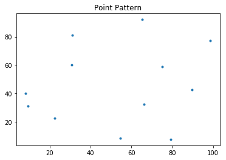

</div>
</div>
</div>


## Nearest Neighbor Distance Functions

Nearest neighbour distance distribution functions (including the nearest “event-to-event” and “point-event” distance distribution functions) of a point process are cumulative distribution functions of several kinds -- $G, F, J$. By comparing the distance function of the observed point pattern with that of the point pattern from a CSR process, we are able to infer whether the underlying spatial process of the observed point pattern is CSR or not for a given confidence level.


#### $G$ function - event-to-event

The $G$ function is defined as follows: for a given distance $d$, $G(d)$ is the proportion of nearest neighbor distances that are less than $d$.
$$G(d) = \sum_{i=1}^n \frac{ \phi_i^d}{n}$$

$$ 
\phi_i^d =
 \begin{cases}
    1       & \quad \text{if } d_{min}(s_i)<d \\
    0       & \quad \text{otherwise } \\
  \end{cases}
$$

If the underlying point process is a CSR process, $G$ function has an expectation of:
$$
G(d) = 1-e(-\lambda \pi d^2)
$$
However, if the $G$ function plot is above the expectation this reflects clustering, while departures below expectation reflect dispersion.


<div markdown="1" class="cell code_cell">
<div class="input_area" markdown="1">
```python
gp1 = G(pp, intervals=20)
gp1.plot()


```
</div>

<div class="output_wrapper" markdown="1">
<div class="output_subarea" markdown="1">

{:.output_png}
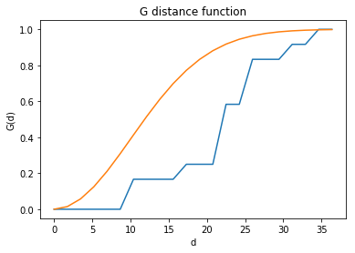

</div>
</div>
</div>


A slightly different visualization of the empirical function is the quantile-quantile plot:


<div markdown="1" class="cell code_cell">
<div class="input_area" markdown="1">
```python
gp1.plot(qq=True)

```
</div>

<div class="output_wrapper" markdown="1">
<div class="output_subarea" markdown="1">

{:.output_png}
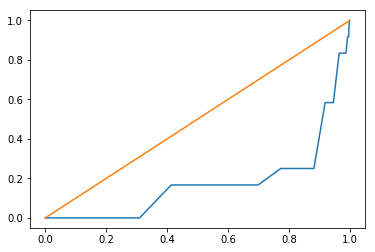

</div>
</div>
</div>


in the q-q plot the csr function is now a diagonal line which serves to make accessment of departures from csr visually easier.


It is obvious that the above $G$ increases very slowly at small distances and the line is below the expected value for a CSR process (green  line). We might think that the underlying spatial process is regular point process. However, this visual inspection is not enough for a final conclusion.  In [Simulation Envelopes](#Simulation-Envelopes), we are going to demonstrate how to simulate data under CSR many times and construct the $95\%$ simulation envelope for $G$.


<div markdown="1" class="cell code_cell">
<div class="input_area" markdown="1">
```python
gp1.d # distance domain sequence (corresponding to the x-axis)

```
</div>

<div class="output_wrapper" markdown="1">
<div class="output_subarea" markdown="1">


{:.output_data_text}
```
array([ 0.        ,  1.73156208,  3.46312417,  5.19468625,  6.92624834,
        8.65781042, 10.3893725 , 12.12093459, 13.85249667, 15.58405875,
       17.31562084, 19.04718292, 20.77874501, 22.51030709, 24.24186917,
       25.97343126, 27.70499334, 29.43655542, 31.16811751, 32.89967959,
       34.63124168, 36.36280376])
```


</div>
</div>
</div>


<div markdown="1" class="cell code_cell">
<div class="input_area" markdown="1">
```python
gp1.G #cumulative nearest neighbor distance distribution over d (corresponding to the y-axis))

```
</div>

<div class="output_wrapper" markdown="1">
<div class="output_subarea" markdown="1">


{:.output_data_text}
```
array([0.        , 0.        , 0.        , 0.        , 0.        ,
       0.        , 0.16666667, 0.16666667, 0.16666667, 0.16666667,
       0.25      , 0.25      , 0.25      , 0.58333333, 0.58333333,
       0.83333333, 0.83333333, 0.83333333, 0.91666667, 0.91666667,
       1.        , 1.        ])
```


</div>
</div>
</div>


#### $F$ function - "point-event"

When the number of events in a point pattern is small, $G$ function is rough (see the $G$ function plot for the 12 size point pattern above). One way to get around this is to turn to $F$ funtion where a given number of randomly distributed points are generated in the domain and the nearest event neighbor distance is calculated for each point. The cumulative distribution of all nearest event neighbor distances is called $F$ function.


<div markdown="1" class="cell code_cell">
<div class="input_area" markdown="1">
```python
fp1 = F(pp, intervals=20) # The default is to randomly generate 100 points.
fp1.plot()

```
</div>

<div class="output_wrapper" markdown="1">
<div class="output_subarea" markdown="1">

{:.output_png}
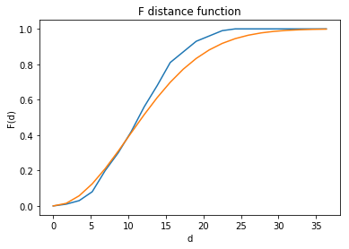

</div>
</div>
</div>


<div markdown="1" class="cell code_cell">
<div class="input_area" markdown="1">
```python
fp1.plot(qq=True)

```
</div>

<div class="output_wrapper" markdown="1">
<div class="output_subarea" markdown="1">

{:.output_png}
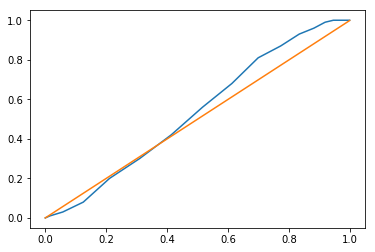

</div>
</div>
</div>


We can increase the number of intervals to make $F$ more smooth.


<div markdown="1" class="cell code_cell">
<div class="input_area" markdown="1">
```python
fp1 = F(pp, intervals=50)
fp1.plot()

```
</div>

<div class="output_wrapper" markdown="1">
<div class="output_subarea" markdown="1">

{:.output_png}
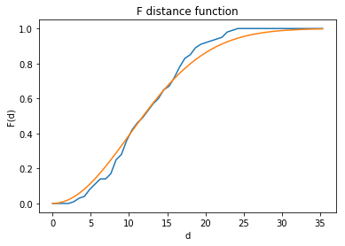

</div>
</div>
</div>


<div markdown="1" class="cell code_cell">
<div class="input_area" markdown="1">
```python
fp1.plot(qq=True)

```
</div>

<div class="output_wrapper" markdown="1">
<div class="output_subarea" markdown="1">

{:.output_png}


</div>
</div>
</div>


$F$ function is more smooth than $G$ function. 


#### $J$ function - a combination of "event-event" and "point-event"

$J$ function is defined as follows:

$$J(d) = \frac{1-G(d)}{1-F(d)}$$

If $J(d)<1$, the underlying point process is a cluster point process; if $J(d)=1$, the underlying point process is a random point process; otherwise, it is a regular point process.


<div markdown="1" class="cell code_cell">
<div class="input_area" markdown="1">
```python
jp1 = J(pp, intervals=20)
jp1.plot()

```
</div>

<div class="output_wrapper" markdown="1">
<div class="output_subarea" markdown="1">

{:.output_png}


</div>
</div>
</div>


From the above figure, we can observe that $J$ function is obviously above the $J(d)=1$ horizontal line. It is approaching infinity with nearest neighbor distance increasing. We might tend to conclude that the underlying point process is a regular one.


## Interevent Distance Functions

Nearest neighbor distance functions consider only the nearest neighbor distances, "event-event", "point-event" or the combination. Thus, distances to higer order neighbors are ignored, which might reveal important information regarding the point process. Interevent distance functions, including $K$ and $L$ functions, are proposed to consider distances between all pairs of event points. Similar to $G$, $F$ and $J$ functions, $K$ and $L$ functions are also cumulative distribution function.

#### $K$ function - "interevent"

Given distance $d$, $K(d)$ is defined as:
$$K(d) = \frac{\sum_{i=1}^n \sum_{j=1}^n \psi_{ij}(d)}{n \hat{\lambda}}$$

where
$$ 
\psi_{ij}(d) =
 \begin{cases}
    1       & \quad \text{if } d_{ij}<d \\
    0       & \quad \text{otherwise } \\
  \end{cases}
$$

$\sum_{j=1}^n \psi_{ij}(d)$ is the number of events within a circle of radius $d$ centered on event $s_i$ .

Still, we use CSR as the benchmark (null hypothesis) and see how the $K$ funtion estimated from the observed point pattern deviate from that under CSR, which is $K(d)=\pi d^2$. $K(d)<\pi d^2$ indicates that the underlying point process is a regular point process. $K(d)>\pi d^2$ indicates that the underlying point process is a cluster point process. 


<div markdown="1" class="cell code_cell">
<div class="input_area" markdown="1">
```python
kp1 = K(pp)
kp1.plot()

```
</div>

<div class="output_wrapper" markdown="1">
<div class="output_subarea" markdown="1">

{:.output_png}
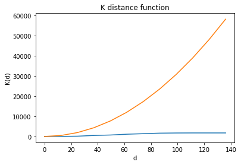

</div>
</div>
</div>


#### $L$ function - "interevent"

$L$ function is a scaled version of $K$ function, defined as:
$$L(d) = \sqrt{\frac{K(d)}{\pi}}-d$$


<div markdown="1" class="cell code_cell">
<div class="input_area" markdown="1">
```python
lp1 = L(pp)
lp1.plot()

```
</div>

<div class="output_wrapper" markdown="1">
<div class="output_subarea" markdown="1">

{:.output_png}


</div>
</div>
</div>


## Simulation Envelopes

A [Simulation envelope](http://www.esajournals.org/doi/pdf/10.1890/13-2042.1) is a computer intensive technique for inferring whether an observed pattern significantly deviates from what would be expected under a specific process. Here, we always use CSR as the benchmark. In order to construct a simulation envelope for a given function, we need to simulate CSR a lot of times, say $1000$ times. Then, we can calculate the function for each simulated point pattern. For every distance $d$, we sort the function values of the $1000$ simulated point patterns. Given a confidence level, say $95\%$, we can acquire the $25$th and $975$th value for every distance $d$. Thus, a simulation envelope is constructed. 


#### Simulation Envelope for G function

**Genv** class in pysal.


<div markdown="1" class="cell code_cell">
<div class="input_area" markdown="1">
```python
realizations = PoissonPointProcess(pp.window, pp.n, 100, asPP=True) # simulate CSR 100 times
genv = Genv(pp, intervals=20, realizations=realizations) # call Genv to generate simulation envelope
genv

```
</div>

<div class="output_wrapper" markdown="1">
<div class="output_subarea" markdown="1">


{:.output_data_text}
```
<pointpats.distance_statistics.Genv at 0x1b22d502b0>
```


</div>
</div>
</div>


<div markdown="1" class="cell code_cell">
<div class="input_area" markdown="1">
```python
genv.observed 

```
</div>

<div class="output_wrapper" markdown="1">
<div class="output_subarea" markdown="1">


{:.output_data_text}
```
array([[ 0.        ,  0.        ],
       [ 1.73156208,  0.        ],
       [ 3.46312417,  0.        ],
       [ 5.19468625,  0.        ],
       [ 6.92624834,  0.        ],
       [ 8.65781042,  0.        ],
       [10.3893725 ,  0.16666667],
       [12.12093459,  0.16666667],
       [13.85249667,  0.16666667],
       [15.58405875,  0.16666667],
       [17.31562084,  0.25      ],
       [19.04718292,  0.25      ],
       [20.77874501,  0.25      ],
       [22.51030709,  0.58333333],
       [24.24186917,  0.58333333],
       [25.97343126,  0.83333333],
       [27.70499334,  0.83333333],
       [29.43655542,  0.83333333],
       [31.16811751,  0.91666667],
       [32.89967959,  0.91666667],
       [34.63124168,  1.        ],
       [36.36280376,  1.        ]])
```


</div>
</div>
</div>


<div markdown="1" class="cell code_cell">
<div class="input_area" markdown="1">
```python
genv.plot()

```
</div>

<div class="output_wrapper" markdown="1">
<div class="output_subarea" markdown="1">

{:.output_png}
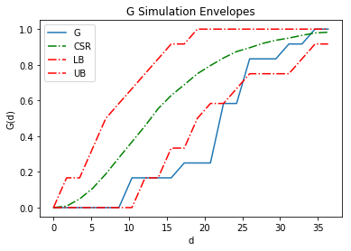

</div>
</div>
</div>


In the above figure, **LB** and **UB** comprise the simulation envelope. **CSR** is the mean function calculated from the simulated data. **G** is the function estimated from the observed point pattern. It is well below the simulation envelope. We can infer that the underlying point process is a regular one.


#### Simulation Envelope for F function

**Fenv** class in pysal.


<div markdown="1" class="cell code_cell">
<div class="input_area" markdown="1">
```python
fenv = Fenv(pp, intervals=20, realizations=realizations)
fenv.plot()

```
</div>

<div class="output_wrapper" markdown="1">
<div class="output_subarea" markdown="1">

{:.output_png}
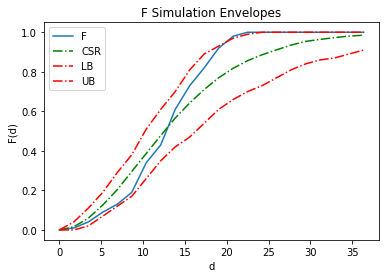

</div>
</div>
</div>


#### Simulation Envelope for J function

**Jenv** class in pysal.


<div markdown="1" class="cell code_cell">
<div class="input_area" markdown="1">
```python
jenv = Jenv(pp, intervals=20, realizations=realizations)
jenv.plot()

```
</div>

<div class="output_wrapper" markdown="1">
<div class="output_subarea" markdown="1">

{:.output_png}
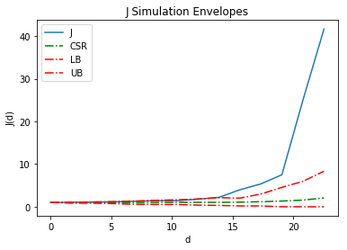

</div>
</div>
</div>


#### Simulation Envelope for K function

**Kenv** class in pysal.


<div markdown="1" class="cell code_cell">
<div class="input_area" markdown="1">
```python
kenv = Kenv(pp, intervals=20, realizations=realizations)
kenv.plot()

```
</div>

<div class="output_wrapper" markdown="1">
<div class="output_subarea" markdown="1">

{:.output_png}
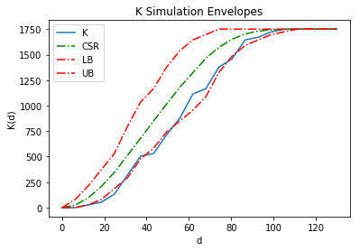

</div>
</div>
</div>


#### Simulation Envelope for L function

**Lenv** class in pysal.


<div markdown="1" class="cell code_cell">
<div class="input_area" markdown="1">
```python
lenv = Lenv(pp, intervals=20, realizations=realizations)
lenv.plot()

```
</div>

<div class="output_wrapper" markdown="1">
<div class="output_subarea" markdown="1">

{:.output_png}
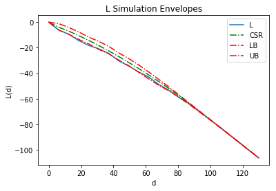

</div>
</div>
</div>


## CSR Example
In this example, we are going to generate a point pattern as the "observed" point pattern. The data generating process is CSR. Then, we will simulate CSR in the same domain for 100 times and construct a simulation envelope for each function.


<div markdown="1" class="cell code_cell">
<div class="input_area" markdown="1">
```python
from pysal.lib.cg import shapely_ext
from pysal.explore.pointpats import Window
import pysal.lib as ps
va = ps.io.open(ps.examples.get_path("vautm17n.shp"))
polys = [shp for shp in va]
state = shapely_ext.cascaded_union(polys)

```
</div>

</div>


Generate the point pattern **pp** (size 100) from CSR as the "observed" point pattern.


<div markdown="1" class="cell code_cell">
<div class="input_area" markdown="1">
```python
a = [[1],[1,2]]
np.asarray(a)

```
</div>

<div class="output_wrapper" markdown="1">
<div class="output_subarea" markdown="1">


{:.output_data_text}
```
array([list([1]), list([1, 2])], dtype=object)
```


</div>
</div>
</div>


<div markdown="1" class="cell code_cell">
<div class="input_area" markdown="1">
```python
n = 100
samples = 1
pp = PoissonPointProcess(Window(state.parts), n, samples, asPP=True)
pp.realizations[0]

```
</div>

<div class="output_wrapper" markdown="1">
<div class="output_subarea" markdown="1">


{:.output_data_text}
```
<pointpats.pointpattern.PointPattern at 0x1b22d31cf8>
```


</div>
</div>
</div>


<div markdown="1" class="cell code_cell">
<div class="input_area" markdown="1">
```python
pp.n

```
</div>

<div class="output_wrapper" markdown="1">
<div class="output_subarea" markdown="1">


{:.output_data_text}
```
100
```


</div>
</div>
</div>


Simulate CSR in the same domian for 100 times which would be used for constructing simulation envelope under the null hypothesis of CSR.


<div markdown="1" class="cell code_cell">
<div class="input_area" markdown="1">
```python
csrs = PoissonPointProcess(pp.window, 100, 100, asPP=True)
csrs

```
</div>

<div class="output_wrapper" markdown="1">
<div class="output_subarea" markdown="1">


{:.output_data_text}
```
<pointpats.process.PoissonPointProcess at 0x1b22d31240>
```


</div>
</div>
</div>


Construct the simulation envelope for $G$ function.


<div markdown="1" class="cell code_cell">
<div class="input_area" markdown="1">
```python
genv = Genv(pp.realizations[0], realizations=csrs)
genv.plot()

```
</div>

<div class="output_wrapper" markdown="1">
<div class="output_subarea" markdown="1">

{:.output_png}
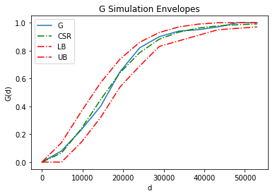

</div>
</div>
</div>


Since the "observed" $G$ is well contained by the simulation envelope, we infer that the underlying point process is a random process.


<div markdown="1" class="cell code_cell">
<div class="input_area" markdown="1">
```python
genv.low # lower bound of the simulation envelope for G

```
</div>

<div class="output_wrapper" markdown="1">
<div class="output_subarea" markdown="1">


{:.output_data_text}
```
array([0.  , 0.  , 0.14, 0.32, 0.54, 0.69, 0.83, 0.87, 0.91, 0.95, 0.96,
       0.97])
```


</div>
</div>
</div>


<div markdown="1" class="cell code_cell">
<div class="input_area" markdown="1">
```python
genv.high # higher bound of the simulation envelope for G

```
</div>

<div class="output_wrapper" markdown="1">
<div class="output_subarea" markdown="1">


{:.output_data_text}
```
array([0.  , 0.14, 0.36, 0.57, 0.74, 0.86, 0.93, 0.97, 0.99, 1.  , 1.  ,
       1.  ])
```


</div>
</div>
</div>


Construct the simulation envelope for $F$ function.


<div markdown="1" class="cell code_cell">
<div class="input_area" markdown="1">
```python
fenv = Fenv(pp.realizations[0], realizations=csrs)
fenv.plot()

```
</div>

<div class="output_wrapper" markdown="1">
<div class="output_subarea" markdown="1">

{:.output_png}
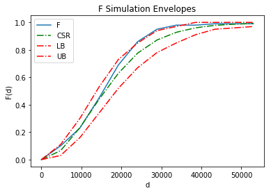

</div>
</div>
</div>


Construct the simulation envelope for $J$ function.


<div markdown="1" class="cell code_cell">
<div class="input_area" markdown="1">
```python
jenv = Jenv(pp.realizations[0], realizations=csrs)
jenv.plot()

```
</div>

<div class="output_wrapper" markdown="1">
<div class="output_subarea" markdown="1">

{:.output_png}


</div>
</div>
</div>


Construct the simulation envelope for $K$ function.


<div markdown="1" class="cell code_cell">
<div class="input_area" markdown="1">
```python
kenv = Kenv(pp.realizations[0], realizations=csrs)
kenv.plot()

```
</div>

<div class="output_wrapper" markdown="1">
<div class="output_subarea" markdown="1">

{:.output_png}
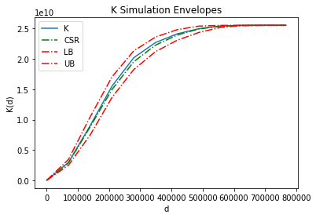

</div>
</div>
</div>


Construct the simulation envelope for $L$ function.


<div markdown="1" class="cell code_cell">
<div class="input_area" markdown="1">
```python
lenv = Lenv(pp.realizations[0], realizations=csrs)
lenv.plot()

```
</div>

<div class="output_wrapper" markdown="1">
<div class="output_subarea" markdown="1">

{:.output_png}


</div>
</div>
</div>

