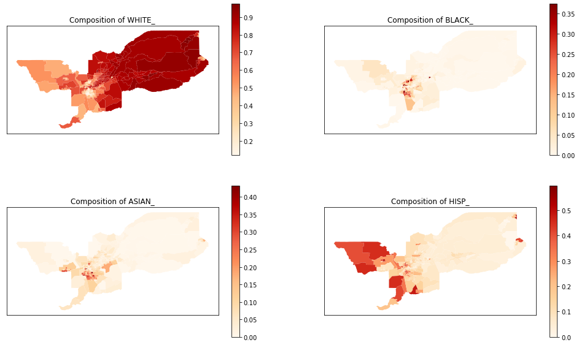

---
redirect_from:
  - "/explore/segregation/multigroup-aspatial-examples"
interact_link: content/explore/segregation/multigroup_aspatial_examples.ipynb
kernel_name: python3
has_widgets: false
title: 'multigroup_aspatial_examples'
prev_page:
  url: /explore/segregation/multiscalar_segregation_profiles
  title: 'multiscalar_segregation_profiles'
next_page:
  url: /explore/segregation/compute_all_example
  title: 'compute_all_example'
comment: "***PROGRAMMATICALLY GENERATED, DO NOT EDIT. SEE ORIGINAL FILES IN /content***"
---


# Multigroup aspatial indexes of segregation


This is an example notebook of functionalities for multigroup aspatial indexes of the *segregation* module. Firstly, we need to import the packages we need:


<div markdown="1" class="cell code_cell">
<div class="input_area" markdown="1">
```python
%%capture

import pysal.lib
from pysal.explore import segregation
import geopandas as gpd

```
</div>

</div>


Then it's time to load some data to estimate segregation. We use the data of 2000 Census Tract Data for the metropolitan area of Sacramento, CA, USA. 

We use a geopandas dataframe available in PySAL examples repository.

For more information about the data: https://github.com/pysal/pysal.lib/tree/master/pysal.lib/examples/sacramento2


<div markdown="1" class="cell code_cell">
<div class="input_area" markdown="1">
```python
input_df = gpd.read_file(pysal.lib.examples.get_path("sacramentot2.shp"))
input_df.columns

```
</div>

<div class="output_wrapper" markdown="1">
<div class="output_subarea" markdown="1">


{:.output_data_text}
```
Index(['FIPS', 'MSA', 'TOT_POP', 'POP_16', 'POP_65', 'WHITE_', 'BLACK_',
       'ASIAN_', 'HISP_', 'MULTI_RA', 'MALES', 'FEMALES', 'MALE1664',
       'FEM1664', 'EMPL16', 'EMP_AWAY', 'EMP_HOME', 'EMP_29', 'EMP_30',
       'EMP16_2', 'EMP_MALE', 'EMP_FEM', 'OCC_MAN', 'OCC_OFF1', 'OCC_INFO',
       'HH_INC', 'POV_POP', 'POV_TOT', 'HSG_VAL', 'FIPSNO', 'POLYID',
       'geometry'],
      dtype='object')
```


</div>
</div>
</div>


The groups of interest are White, Black, Asian and Hispanic population. Therefore, we create an auxiliary list with only the necessary columns for fitting the index.


<div markdown="1" class="cell code_cell">
<div class="input_area" markdown="1">
```python
groups_list = ['WHITE_', 'BLACK_', 'ASIAN_','HISP_']

```
</div>

</div>


We also can plot the spatial distribution of the composition of each of these groups over the tracts of Sacramento:


<div markdown="1" class="cell code_cell">
<div class="input_area" markdown="1">
```python
import matplotlib.pyplot as plt

for i in range(len(groups_list)):
    input_df['comp_' + groups_list[i]] = input_df[groups_list[i]] / input_df['TOT_POP']

fig, axes = plt.subplots(ncols = 2, nrows = 2, figsize = (17, 10))


input_df.plot(column = 'comp_' + groups_list[0],
              cmap = 'OrRd',
              legend = True, ax = axes[0,0])
axes[0,0].set_title('Composition of ' + groups_list[0])
axes[0,0].set_xticks([])
axes[0,0].set_yticks([])
axes[0,0].set_facecolor('white')


input_df.plot(column = 'comp_' + groups_list[1],
              cmap = 'OrRd',
              legend = True, ax = axes[0,1])
axes[0,1].set_title('Composition of ' + groups_list[1])
axes[0,1].set_xticks([])
axes[0,1].set_yticks([])
axes[0,1].set_facecolor('white')


input_df.plot(column = 'comp_' + groups_list[2],
              cmap = 'OrRd',
              legend = True, ax = axes[1,0])
axes[1,0].set_title('Composition of ' + groups_list[2])
axes[1,0].set_xticks([])
axes[1,0].set_yticks([])
axes[1,0].set_facecolor('white')

input_df.plot(column = 'comp_' + groups_list[3],
              cmap = 'OrRd',
              legend = True, ax = axes[1,1])
axes[1,1].set_title('Composition of ' + groups_list[3])
axes[1,1].set_xticks([])
axes[1,1].set_yticks([])
axes[1,1].set_facecolor('white')

```
</div>

<div class="output_wrapper" markdown="1">
<div class="output_subarea" markdown="1">

{:.output_png}


</div>
</div>
</div>


# Multigroup Dissimilarity Index


<div markdown="1" class="cell code_cell">
<div class="input_area" markdown="1">
```python
%%capture
from pysal.explore.segregation.aspatial import MultiDissim

```
</div>

</div>


<div markdown="1" class="cell code_cell">
<div class="input_area" markdown="1">
```python
index = MultiDissim(input_df, groups_list)
type(index)

```
</div>

<div class="output_wrapper" markdown="1">
<div class="output_subarea" markdown="1">


{:.output_data_text}
```
segregation.aspatial.multigroup_aspatial_indexes.MultiDissim
```


</div>
</div>
</div>


<div markdown="1" class="cell code_cell">
<div class="input_area" markdown="1">
```python
index.statistic

```
</div>

<div class="output_wrapper" markdown="1">
<div class="output_subarea" markdown="1">


{:.output_data_text}
```
0.41340872573177806
```


</div>
</div>
</div>


# Multigroup Gini Index


<div markdown="1" class="cell code_cell">
<div class="input_area" markdown="1">
```python
%%capture
from pysal.explore.segregation.aspatial import MultiGiniSeg

```
</div>

</div>


<div markdown="1" class="cell code_cell">
<div class="input_area" markdown="1">
```python
index = MultiGiniSeg(input_df, groups_list)
type(index)

```
</div>

<div class="output_wrapper" markdown="1">
<div class="output_subarea" markdown="1">


{:.output_data_text}
```
segregation.aspatial.multigroup_aspatial_indexes.MultiGiniSeg
```


</div>
</div>
</div>


<div markdown="1" class="cell code_cell">
<div class="input_area" markdown="1">
```python
index.statistic

```
</div>

<div class="output_wrapper" markdown="1">
<div class="output_subarea" markdown="1">


{:.output_data_text}
```
0.5456349992598081
```


</div>
</div>
</div>


# Multigroup Normalized Exposure Index


<div markdown="1" class="cell code_cell">
<div class="input_area" markdown="1">
```python
%%capture
from pysal.explore.segregation.aspatial import MultiNormalizedExposure

```
</div>

</div>


<div markdown="1" class="cell code_cell">
<div class="input_area" markdown="1">
```python
index = MultiNormalizedExposure(input_df, groups_list)
type(index)

```
</div>

<div class="output_wrapper" markdown="1">
<div class="output_subarea" markdown="1">


{:.output_data_text}
```
segregation.aspatial.multigroup_aspatial_indexes.MultiNormalizedExposure
```


</div>
</div>
</div>


<div markdown="1" class="cell code_cell">
<div class="input_area" markdown="1">
```python
index.statistic

```
</div>

<div class="output_wrapper" markdown="1">
<div class="output_subarea" markdown="1">


{:.output_data_text}
```
0.18821879029994157
```


</div>
</div>
</div>


# Multigroup Information Theory Index


<div markdown="1" class="cell code_cell">
<div class="input_area" markdown="1">
```python
%%capture
from pysal.explore.segregation.aspatial import MultiInformationTheory

```
</div>

</div>


<div markdown="1" class="cell code_cell">
<div class="input_area" markdown="1">
```python
index = MultiInformationTheory(input_df, groups_list)
type(index)

```
</div>

<div class="output_wrapper" markdown="1">
<div class="output_subarea" markdown="1">


{:.output_data_text}
```
segregation.aspatial.multigroup_aspatial_indexes.MultiInformationTheory
```


</div>
</div>
</div>


<div markdown="1" class="cell code_cell">
<div class="input_area" markdown="1">
```python
index.statistic

```
</div>

<div class="output_wrapper" markdown="1">
<div class="output_subarea" markdown="1">


{:.output_data_text}
```
0.1710160297858887
```


</div>
</div>
</div>


# Multigroup Relative Diversity Index


<div markdown="1" class="cell code_cell">
<div class="input_area" markdown="1">
```python
%%capture
from pysal.explore.segregation.aspatial import MultiRelativeDiversity

```
</div>

</div>


<div markdown="1" class="cell code_cell">
<div class="input_area" markdown="1">
```python
index = MultiRelativeDiversity(input_df, groups_list)
type(index)

```
</div>

<div class="output_wrapper" markdown="1">
<div class="output_subarea" markdown="1">


{:.output_data_text}
```
segregation.aspatial.multigroup_aspatial_indexes.MultiRelativeDiversity
```


</div>
</div>
</div>


<div markdown="1" class="cell code_cell">
<div class="input_area" markdown="1">
```python
index.statistic

```
</div>

<div class="output_wrapper" markdown="1">
<div class="output_subarea" markdown="1">


{:.output_data_text}
```
0.15820019878220337
```


</div>
</div>
</div>


# Multigroup Squared Coefficient of Variation Index


<div markdown="1" class="cell code_cell">
<div class="input_area" markdown="1">
```python
%%capture
from pysal.explore.segregation.aspatial import MultiSquaredCoefficientVariation

```
</div>

</div>


<div markdown="1" class="cell code_cell">
<div class="input_area" markdown="1">
```python
index = MultiSquaredCoefficientVariation(input_df, groups_list)
type(index)

```
</div>

<div class="output_wrapper" markdown="1">
<div class="output_subarea" markdown="1">


{:.output_data_text}
```
segregation.aspatial.multigroup_aspatial_indexes.MultiSquaredCoefficientVariation
```


</div>
</div>
</div>


<div markdown="1" class="cell code_cell">
<div class="input_area" markdown="1">
```python
index.statistic

```
</div>

<div class="output_wrapper" markdown="1">
<div class="output_subarea" markdown="1">


{:.output_data_text}
```
0.11875484641127525
```


</div>
</div>
</div>


# Multigroup Diversity Index


<div markdown="1" class="cell code_cell">
<div class="input_area" markdown="1">
```python
%%capture
from pysal.explore.segregation.aspatial import MultiDiversity

```
</div>

</div>


<div markdown="1" class="cell code_cell">
<div class="input_area" markdown="1">
```python
index = MultiDiversity(input_df, groups_list)
type(index)

```
</div>

<div class="output_wrapper" markdown="1">
<div class="output_subarea" markdown="1">


{:.output_data_text}
```
segregation.aspatial.multigroup_aspatial_indexes.MultiDiversity
```


</div>
</div>
</div>


<div markdown="1" class="cell code_cell">
<div class="input_area" markdown="1">
```python
index.statistic

```
</div>

<div class="output_wrapper" markdown="1">
<div class="output_subarea" markdown="1">


{:.output_data_text}
```
0.9733112243997906
```


</div>
</div>
</div>


<div markdown="1" class="cell code_cell">
<div class="input_area" markdown="1">
```python
# Normalized version of the multigroup diversity index
normalized_index = MultiDiversity(input_df, groups_list, normalized = True)
normalized_index.statistic

```
</div>

<div class="output_wrapper" markdown="1">
<div class="output_subarea" markdown="1">


{:.output_data_text}
```
0.7020956383415715
```


</div>
</div>
</div>


# Simpson's Concentration Index (lambda)


<div markdown="1" class="cell code_cell">
<div class="input_area" markdown="1">
```python
%%capture
from pysal.explore.segregation.aspatial import SimpsonsConcentration

```
</div>

</div>


<div markdown="1" class="cell code_cell">
<div class="input_area" markdown="1">
```python
index = SimpsonsConcentration(input_df, groups_list)
type(index)

```
</div>

<div class="output_wrapper" markdown="1">
<div class="output_subarea" markdown="1">


{:.output_data_text}
```
segregation.aspatial.multigroup_aspatial_indexes.SimpsonsConcentration
```


</div>
</div>
</div>


<div markdown="1" class="cell code_cell">
<div class="input_area" markdown="1">
```python
index.statistic

```
</div>

<div class="output_wrapper" markdown="1">
<div class="output_subarea" markdown="1">


{:.output_data_text}
```
0.49182413151957904
```


</div>
</div>
</div>


# Simpson's Interaction Index (I)


<div markdown="1" class="cell code_cell">
<div class="input_area" markdown="1">
```python
%%capture
from pysal.explore.segregation.aspatial import SimpsonsInteraction

```
</div>

</div>


<div markdown="1" class="cell code_cell">
<div class="input_area" markdown="1">
```python
index = SimpsonsInteraction(input_df, groups_list)
type(index)

```
</div>

<div class="output_wrapper" markdown="1">
<div class="output_subarea" markdown="1">


{:.output_data_text}
```
segregation.aspatial.multigroup_aspatial_indexes.SimpsonsInteraction
```


</div>
</div>
</div>


<div markdown="1" class="cell code_cell">
<div class="input_area" markdown="1">
```python
index.statistic

```
</div>

<div class="output_wrapper" markdown="1">
<div class="output_subarea" markdown="1">


{:.output_data_text}
```
0.508175868480421
```


</div>
</div>
</div>


# Multigroup Divergence Index


<div markdown="1" class="cell code_cell">
<div class="input_area" markdown="1">
```python
%%capture
from pysal.explore.segregation.aspatial import MultiDivergence

```
</div>

</div>


<div markdown="1" class="cell code_cell">
<div class="input_area" markdown="1">
```python
index = MultiDivergence(input_df, groups_list)
type(index)

```
</div>

<div class="output_wrapper" markdown="1">
<div class="output_subarea" markdown="1">


{:.output_data_text}
```
segregation.aspatial.multigroup_aspatial_indexes.MultiDivergence
```


</div>
</div>
</div>


<div markdown="1" class="cell code_cell">
<div class="input_area" markdown="1">
```python
index.statistic

```
</div>

<div class="output_wrapper" markdown="1">
<div class="output_subarea" markdown="1">


{:.output_data_text}
```
0.16645182134289443
```


</div>
</div>
</div>

