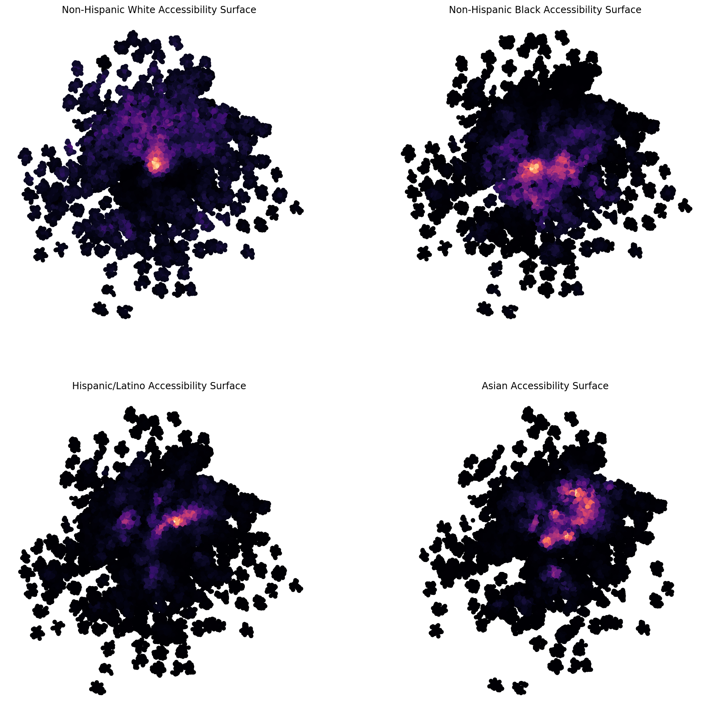

---
redirect_from:
  - "/explore/segregation/network-measures"
interact_link: content/explore/segregation/network_measures.ipynb
kernel_name: python3
has_widgets: false
title: 'network_measures'
prev_page:
  url: /explore/segregation/compute_all_example
  title: 'compute_all_example'
next_page:
  url: /explore/segregation/spatial_examples
  title: 'spatial_examples'
comment: "***PROGRAMMATICALLY GENERATED, DO NOT EDIT. SEE ORIGINAL FILES IN /content***"
---


# Network-based Spatial Information Theory Index
## *from scratch*


What if you want to calculate the best segregation measure starting with no data?  
We've got you covered


*This notebook uses functionality found in the [`cenpy.products`](https://nbviewer.jupyter.org/gist/ljwolf/3481aeadf1b0fbb46b72553a08bfc4e6?flush_cache=true) module, which will be released officially in July. If you want to replicate this notebook prior to `cenpy`'s 1.0 release, you can install the development version of  with `pip install git+https://github.com/ljwolf/cenpy.git@product`*

*Further, the notebook leverages a function from [contextily](https://github.com/darribas/contextily) that has not yet been released. Similar to above, you can use the most recent github version of the library to replicated the functionality in this notebook with `pip install git+https://github.com/darribas/contextily.git`*


<div markdown="1" class="cell code_cell">
<div class="input_area" markdown="1">
```python
%load_ext autoreload
%autoreload 2
import geopandas as gpd
from pysal.explore import segregation
import matplotlib.pyplot as plt
import seaborn as sns
import contextily as ctx
import cenpy

sns.set_context('notebook')

```
</div>

</div>


<div markdown="1" class="cell code_cell">
<div class="input_area" markdown="1">
```python
cenpy.set_sitekey('d4d0ad648fffc219dc272b6af90e5b2106235a12', overwrite=True) # note you should replace this key with your own from here: https://api.census.gov/data/key_signup.html

```
</div>

<div class="output_wrapper" markdown="1">
<div class="output_subarea" markdown="1">


{:.output_data_text}
```
'/Users/knaaptime/python_packages/cenpy/cenpy/SITEKEY.txt'
```


</div>
</div>
</div>


<br>
First, we need to collect some data from the Census API. Using `cenpy`, we can grab all the necessary data in a single call. Let's store the variables we need in a list (these are total population counts from the 2017 ACS. See the [census api docs](https://api.census.gov/data/2017/acs/acs5/variables.html) for more details)  

<br>
    


<div markdown="1" class="cell code_cell">
<div class="input_area" markdown="1">
```python
black = 'B03002_004E'
white = 'B03002_003E'
hispanic = 'B03002_012E'
asian = 'B03002_006E'
variables = [white, black, hispanic, asian]

```
</div>

</div>


<br>
Using Atlanta as a test case, we'll grab the data for the four different race categories and plot the non-hispanic Black population


<div markdown="1" class="cell code_cell">
<div class="input_area" markdown="1">
```python
atl = cenpy.products.ACS(2017).from_msa(name='Atlanta, GA', variables=variables.copy(), level='tract')

```
</div>

<div class="output_wrapper" markdown="1">
<div class="output_subarea" markdown="1">
{:.output_stream}
```
Matched: Atlanta, GA to Atlanta-Sandy Springs-Roswell, GA within layer Metropolitan Statistical Areas
```
</div>
</div>
</div>


<div markdown="1" class="cell code_cell">
<div class="input_area" markdown="1">
```python
atl.head()

```
</div>

<div class="output_wrapper" markdown="1">
<div class="output_subarea" markdown="1">


<div markdown="0" class="output output_html">
<div>
<style scoped>
    .dataframe tbody tr th:only-of-type {
        vertical-align: middle;
    }

    .dataframe tbody tr th {
        vertical-align: top;
    }

    .dataframe thead th {
        text-align: right;
    }
</style>
<table border="1" class="dataframe">
  <thead>
    <tr style="text-align: right;">
      <th></th>
      <th>GEOID</th>
      <th>geometry</th>
      <th>B03002_003E</th>
      <th>B03002_004E</th>
      <th>B03002_012E</th>
      <th>B03002_006E</th>
      <th>NAME</th>
      <th>state</th>
      <th>county</th>
      <th>tract</th>
    </tr>
  </thead>
  <tbody>
    <tr>
      <th>0</th>
      <td>13149970200</td>
      <td>POLYGON ((-9494862.939999999 3952265.65, -9494...</td>
      <td>4008.0</td>
      <td>222.0</td>
      <td>16.0</td>
      <td>4.0</td>
      <td>Census Tract 9702, Heard County, Georgia</td>
      <td>13</td>
      <td>149</td>
      <td>970200</td>
    </tr>
    <tr>
      <th>1</th>
      <td>13143010302</td>
      <td>POLYGON ((-9494734.369999999 3995852.68, -9494...</td>
      <td>7064.0</td>
      <td>388.0</td>
      <td>107.0</td>
      <td>118.0</td>
      <td>Census Tract 103.02, Haralson County, Georgia</td>
      <td>13</td>
      <td>143</td>
      <td>010302</td>
    </tr>
    <tr>
      <th>2</th>
      <td>13045910501</td>
      <td>POLYGON ((-9480320.83 3974662.93, -9480146.5 3...</td>
      <td>3461.0</td>
      <td>3703.0</td>
      <td>1281.0</td>
      <td>63.0</td>
      <td>Census Tract 9105.01, Carroll County, Georgia</td>
      <td>13</td>
      <td>045</td>
      <td>910501</td>
    </tr>
    <tr>
      <th>3</th>
      <td>13045910600</td>
      <td>POLYGON ((-9474316.59 3979760.54, -9474224.859...</td>
      <td>3771.0</td>
      <td>1431.0</td>
      <td>669.0</td>
      <td>76.0</td>
      <td>Census Tract 9106, Carroll County, Georgia</td>
      <td>13</td>
      <td>045</td>
      <td>910600</td>
    </tr>
    <tr>
      <th>4</th>
      <td>13077170100</td>
      <td>POLYGON ((-9463866.359999999 3951919.92, -9463...</td>
      <td>6133.0</td>
      <td>653.0</td>
      <td>502.0</td>
      <td>71.0</td>
      <td>Census Tract 1701, Coweta County, Georgia</td>
      <td>13</td>
      <td>077</td>
      <td>170100</td>
    </tr>
  </tbody>
</table>
</div>
</div>


</div>
</div>
</div>


<div markdown="1" class="cell code_cell">
<div class="input_area" markdown="1">
```python
fig, ax = plt.subplots(1,1, figsize=(12,12))
atl.plot(column='B03002_004E', ax=ax)
ax.axis('off')

```
</div>

<div class="output_wrapper" markdown="1">
<div class="output_subarea" markdown="1">


{:.output_data_text}
```
(-9516976.031000001, -9257699.189, 3862831.7115, 4123947.9185000006)
```


</div>
</div>
<div class="output_wrapper" markdown="1">
<div class="output_subarea" markdown="1">

{:.output_png}


</div>
</div>
</div>


<div markdown="1" class="cell code_cell">
<div class="input_area" markdown="1">
```python
atl = atl.to_crs({'init': 'epsg:4326'})

```
</div>

</div>


<br>
Now, we'll grab a walkable street network from OSM and use it to calculate our distance-decayed population sums. Under the hood we're using `pandana` and `urbanaccess` from the wonderful [UDST](http://www.urbansim.com/udst)


<div markdown="1" class="cell code_cell">
<div class="input_area" markdown="1">
```python
atl_network = segregation.network.get_osm_network(atl)

```
</div>

</div>


downloading the network takes awhile, so uncomment to save it and you can load later


<div markdown="1" class="cell code_cell">
<div class="input_area" markdown="1">
```python
# atl_network.save_hdf5('atl_network.h5')

```
</div>

</div>


and use this to read it back in


<div markdown="1" class="cell code_cell">
<div class="input_area" markdown="1">
```python
import pandana as pdna
atl_network = pdna.Network.from_hdf5('atl_network.h5')

```
</div>

</div>


<div markdown="1" class="cell code_cell">
<div class="input_area" markdown="1">
```python
# Note that the most recent version of pandana may have some issues with memory consumption that could lead to failure (https://github.com/UDST/pandana/issues/107)
# If your kernel crashes running this cell, try setting a smaller threshold distance like 1000

# this cell can also take 

atl_access = segregation.network.calc_access(atl, network=atl_network, distance=5000, decay='exp', variables=variables)

```
</div>

</div>


<div markdown="1" class="cell code_cell">
<div class="input_area" markdown="1">
```python
atl_access.head()

```
</div>

<div class="output_wrapper" markdown="1">
<div class="output_subarea" markdown="1">


<div markdown="0" class="output output_html">
<div>
<style scoped>
    .dataframe tbody tr th:only-of-type {
        vertical-align: middle;
    }

    .dataframe tbody tr th {
        vertical-align: top;
    }

    .dataframe thead th {
        text-align: right;
    }
</style>
<table border="1" class="dataframe">
  <thead>
    <tr style="text-align: right;">
      <th></th>
      <th>acc_B03002_003E</th>
      <th>acc_B03002_004E</th>
      <th>acc_B03002_012E</th>
      <th>acc_B03002_006E</th>
    </tr>
    <tr>
      <th>id</th>
      <th></th>
      <th></th>
      <th></th>
      <th></th>
    </tr>
  </thead>
  <tbody>
    <tr>
      <th>52373896</th>
      <td>0.0</td>
      <td>0.0</td>
      <td>0.0</td>
      <td>0.0</td>
    </tr>
    <tr>
      <th>52373906</th>
      <td>0.0</td>
      <td>0.0</td>
      <td>0.0</td>
      <td>0.0</td>
    </tr>
    <tr>
      <th>52373995</th>
      <td>0.0</td>
      <td>0.0</td>
      <td>0.0</td>
      <td>0.0</td>
    </tr>
    <tr>
      <th>52374024</th>
      <td>0.0</td>
      <td>0.0</td>
      <td>0.0</td>
      <td>0.0</td>
    </tr>
    <tr>
      <th>52374089</th>
      <td>0.0</td>
      <td>0.0</td>
      <td>0.0</td>
      <td>0.0</td>
    </tr>
  </tbody>
</table>
</div>
</div>


</div>
</div>
</div>


<br>
Inside the accessibility calculation, pandana is snapping each tract centroid to its nearest intersection on the walk network. Then, it calculates the shortest path distance between every pair of intersrctions in the network and sums up the total population for each group accessible within the specified threshold, while applying a distance decay function to discount further distances


<br>
That means population access is measured for *each intersection* in the network. In essence, we're modeling down from the tract level to the intersection level. We can quickly convert the network intersections to a geopandas GeoDataFrame to plot and compare with the original tracts


<div markdown="1" class="cell code_cell">
<div class="input_area" markdown="1">
```python
net_points =gpd.GeoDataFrame(atl_access, geometry=gpd.points_from_xy(atl_network.nodes_df['x'],atl_network.nodes_df['y']))

```
</div>

</div>


<div markdown="1" class="cell code_cell">
<div class="input_area" markdown="1">
```python
net_points.crs = {'init': 'epsg:4326'}

```
</div>

</div>


<div markdown="1" class="cell code_cell">
<div class="input_area" markdown="1">
```python
fig, ax = plt.subplots(1,2,figsize=(30,15))


# tracts
atl.to_crs({'init': 'epsg:3857'}).plot('B03002_004E', ax=ax[0], cmap='magma')
ctx.add_basemap(ax[0],url=ctx.sources.ST_TONER_LITE)
ax[0].axis('off')
ax[0].set_title('Original Tract-Level Data',fontsize=24)

# network
net_points[net_points.acc_B03002_004E > 0].to_crs({'init': 'epsg:3857'}).plot('acc_B03002_004E', alpha=0.01, ax=ax[1], cmap='magma', s=20)
ctx.add_basemap(ax[1],url=ctx.sources.ST_TONER_LITE )
ax[1].axis('off')
ax[1].set_title('Intersection-Level Accessibility Surface ', fontsize=24)

plt.suptitle('Non-Hispanic Black Population')
plt.tight_layout()


```
</div>

<div class="output_wrapper" markdown="1">
<div class="output_subarea" markdown="1">

{:.output_png}


</div>
</div>
</div>


The main advantage of the plot on the right
is that we avoid the visual distortion created by the large but sparsely populated tracts on the periphery and between the highways. It's a much better representation of metropolitan Atlanta's spatial structure. We use this version to compute the spatial information theory index.<br>   

  
Apart from the fact that we're now constraining the visualization to only the developed land, using transparency gives a further sense of the metro's development intensity, since denser areas appear more saturated. The hues have shifted in space slightly (e.g. the the brightest locus has shifted from the southwest in the left map toward the center in the right map) since they now represent distance-weighted densities, rather than totals.


<div markdown="1" class="cell code_cell">
<div class="input_area" markdown="1">
```python
fig, ax = plt.subplots(2,2, figsize=(16,16))
ax = ax.flatten()


net_points[net_points.acc_B03002_003E > 0].to_crs({'init': 'epsg:3857'}).plot('acc_B03002_003E', ax=ax[0], cmap='magma', s=20)
#ctx.add_basemap(ax[1],url=ctx.sources.ST_TONER_LITE )
ax[0].axis('off')
ax[0].set_title('Non-Hispanic White Accessibility Surface ')

net_points[net_points.acc_B03002_004E > 0].to_crs({'init': 'epsg:3857'}).plot('acc_B03002_004E', ax=ax[1], cmap='magma', s=20)
#ctx.add_basemap(ax[1],url=ctx.sources.ST_TONER_LITE )
ax[1].axis('off')
ax[1].set_title('Non-Hispanic Black Accessibility Surface ')

net_points[net_points.acc_B03002_012E > 0].to_crs({'init': 'epsg:3857'}).plot('acc_B03002_012E', ax=ax[2], cmap='magma', s=20)
#ctx.add_basemap(ax[1],url=ctx.sources.ST_TONER_LITE )
ax[2].axis('off')
ax[2].set_title('Hispanic/Latino Accessibility Surface ')

net_points[net_points.acc_B03002_006E > 0].to_crs({'init': 'epsg:3857'}).plot('acc_B03002_006E', ax=ax[3], cmap='magma', s=20)
#ctx.add_basemap(ax[1],url=ctx.sources.ST_TONER_LITE )
ax[3].axis('off')
ax[3].set_title('Asian Accessibility Surface ')

```
</div>

<div class="output_wrapper" markdown="1">
<div class="output_subarea" markdown="1">


{:.output_data_text}
```
Text(0.5, 1, 'Asian Accessibility Surface ')
```


</div>
</div>
<div class="output_wrapper" markdown="1">
<div class="output_subarea" markdown="1">

{:.output_png}


</div>
</div>
</div>


Now we can use these surfaces to calculate the multi-group network-based spatial information theory index


<div markdown="1" class="cell code_cell">
<div class="input_area" markdown="1">
```python
from pysal.explore.segregation.aspatial import Multi_Information_Theory

```
</div>

</div>


<div markdown="1" class="cell code_cell">
<div class="input_area" markdown="1">
```python
accvars = ['acc_'+variable for variable in variables]

```
</div>

</div>


<div markdown="1" class="cell code_cell">
<div class="input_area" markdown="1">
```python
# spatial information theory using the network kernel

Multi_Information_Theory(atl_access, accvars).statistic

```
</div>

<div class="output_wrapper" markdown="1">
<div class="output_subarea" markdown="1">


{:.output_data_text}
```
0.1808120059968371
```


</div>
</div>
</div>


We can compare this statistic with what we would obtain if we didn't consider spatial effects (i.e. if local context is only considered the census tract itself)


<div markdown="1" class="cell code_cell">
<div class="input_area" markdown="1">
```python
# aspatial information theory

Multi_Information_Theory((atl, variables).statistic

```
</div>

<div class="output_wrapper" markdown="1">
<div class="output_subarea" markdown="1">


{:.output_data_text}
```
0.2856858192363312
```


</div>
</div>
</div>

