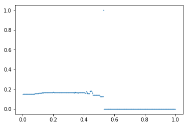

---
redirect_from:
  - "/explore/segregation/spatial-examples"
interact_link: content/explore/segregation/spatial_examples.ipynb
kernel_name: python3
has_widgets: false
title: 'spatial_examples'
prev_page:
  url: /explore/segregation/network_measures
  title: 'network_measures'
next_page:
  url: /explore/segregation/local_measures_example
  title: 'local_measures_example'
comment: "***PROGRAMMATICALLY GENERATED, DO NOT EDIT. SEE ORIGINAL FILES IN /content***"
---


# PySAL *segregation* module for spatial indexes


This is an example notebook of functionalities for spatial indexes of the *segregation* module. Firstly, we need to import the packages we need.


<div markdown="1" class="cell code_cell">
<div class="input_area" markdown="1">
```python
%matplotlib inline

import geopandas as gpd
from pysal.explore import segregation
import pysal.lib

```
</div>

</div>


Then it's time to load some data to estimate segregation. We use the data of 2000 Census Tract Data for the metropolitan area of Sacramento, CA, USA. 

We use a geopandas dataframe available in PySAL examples repository.

For more information about the data: https://github.com/pysal/pysal.lib/tree/master/pysal.lib/examples/sacramento2


<div markdown="1" class="cell code_cell">
<div class="input_area" markdown="1">
```python
s_map = gpd.read_file(pysal.lib.examples.get_path("sacramentot2.shp"))
s_map.columns

```
</div>

<div class="output_wrapper" markdown="1">
<div class="output_subarea" markdown="1">


{:.output_data_text}
```
Index(['FIPS', 'MSA', 'TOT_POP', 'POP_16', 'POP_65', 'WHITE_', 'BLACK_',
       'ASIAN_', 'HISP_', 'MULTI_RA', 'MALES', 'FEMALES', 'MALE1664',
       'FEM1664', 'EMPL16', 'EMP_AWAY', 'EMP_HOME', 'EMP_29', 'EMP_30',
       'EMP16_2', 'EMP_MALE', 'EMP_FEM', 'OCC_MAN', 'OCC_OFF1', 'OCC_INFO',
       'HH_INC', 'POV_POP', 'POV_TOT', 'HSG_VAL', 'FIPSNO', 'POLYID',
       'geometry'],
      dtype='object')
```


</div>
</div>
</div>


The data have several demographic variables. We are going to assess the segregation of the Hispanic Population (variable 'HISP_'). For this, we only extract some columns of the geopandas dataframe.


<div markdown="1" class="cell code_cell">
<div class="input_area" markdown="1">
```python
gdf = s_map[['geometry', 'HISP_', 'TOT_POP']]

```
</div>

</div>


We also can plot the spatial distribution of the composition of the Hispanic population over the tracts of Sacramento:


<div markdown="1" class="cell code_cell">
<div class="input_area" markdown="1">
```python
gdf['composition'] = gdf['HISP_'] / gdf['TOT_POP']

gdf.plot(column = 'composition',
         cmap = 'OrRd', 
         figsize=(20,10),
         legend = True)

```
</div>

<div class="output_wrapper" markdown="1">
<div class="output_subarea" markdown="1">


{:.output_data_text}
```
<matplotlib.axes._subplots.AxesSubplot at 0x13db31ae5c0>
```


</div>
</div>
<div class="output_wrapper" markdown="1">
<div class="output_subarea" markdown="1">

{:.output_png}


</div>
</div>
</div>


## Notation

For consistency of notation, we assume that $n_{ij}$ is the population of unit $i \in \{1, ..., I\}$ of group $j \in \{x, y\}$, also $\sum_{j}n_{ij} = n_{i.}$, $\sum_{i}n_{ij} = n_{.j}$, $\sum_{i}\sum_{j}n_{ij} = n_{..}$, $\tilde{s}_{ij} = \frac{n_{ij}}{n_{i.}}$, $\hat{s}_{ij} = \frac{n_{ij}}{n_{.j}}$. The segregation indexes can be build for any group $j$ of the data.


### Spatial Dissimilarity

The Dissimilarity Index (D) is given by:

\begin{equation}
D=\sum_{i=1}^{I}\frac{n_{i.}\mid \tilde{s}_{ij}-\frac{n_{.j}}{n_{..}}\mid}{2n_{..}\frac{n_{.j}}{n_{..}}\left ( 1-\frac{n_{.j}}{n_{..}} \right ).}
\end{equation}

The Spatial Dissimilarity (SD) is given by:

\begin{equation}
SD = D-\frac{\sum_{i_1=1}^{I}\sum_{i_2=1}^{I}\left | \tilde{s}_{ij}^{i_1}-\tilde{s}_{ij}^{i_2} \right |c_{i_1i_2}}{\sum_{i_1=1}^{I}\sum_{i_2=1}^{I}c_{i_1i_2}}
\end{equation}

where $\tilde{s}_{ij}^{i_1}$ and $\tilde{s}_{ij}^{i_2}$ are the proportions of the minority population in the units $i_1$ and $i_2$, respectively and where $c_{i_1i_2}$ denotes an element at $(i_1,i_2)$ in a matrix C, which becomes one only if $i_1$ and $i_2$ are considered neighbors.


The index is fitted below:


<div markdown="1" class="cell code_cell">
<div class="input_area" markdown="1">
```python
from pysal.explore.segregation.spatial import SpatialDissim
index = SpatialDissim(gdf, 'HISP_', 'TOT_POP')
type(index)

```
</div>

<div class="output_wrapper" markdown="1">
<div class="output_subarea" markdown="1">


{:.output_data_text}
```
segregation.spatial.spatial_indexes.SpatialDissim
```


</div>
</div>
</div>


All the **segregation** classes have the *statistic* and the *core_data* attributes. We can access the point estimation of SD for the data set with the **statistic** attribute:


<div markdown="1" class="cell code_cell">
<div class="input_area" markdown="1">
```python
index.statistic

```
</div>

<div class="output_wrapper" markdown="1">
<div class="output_subarea" markdown="1">


{:.output_data_text}
```
0.2611974332919437
```


</div>
</div>
</div>


### Boundary Spatial Dissimilarity

The boundary spatial D (BSD) is given by:

\begin{equation}
BSD = D - \frac{1}{2}{\sum_{i_1=1}^{I}\sum_{i_2=1}^{I}w_{i_1i_2} \left | \tilde{s}_{ij}^{i_1} - \tilde{s}_{ij}^{i_2} \right |}
\end{equation}

where

$$w_{i_1i_2} = \frac{cb_{i_1i_2}}{\sum_{i_2=1}^{I}d_{i_1i_2}}$$

where $\tilde{s}_{ij}^{i_1}$ and $\tilde{s}_{ij}^{i_2}$ are the proportions of the minority population in the units $i_1$ and $i_2$, respectively, and $cb_{i_1i_2}$ is the length of the common boundary of areal units $i_1$ and $i_2$.


The index is fitted below:


<div markdown="1" class="cell code_cell">
<div class="input_area" markdown="1">
```python
from pysal.explore.segregation.spatial import BoundarySpatialDissim
index = BoundarySpatialDissim(gdf, 'HISP_', 'TOT_POP')
type(index)

```
</div>

<div class="output_wrapper" markdown="1">
<div class="output_subarea" markdown="1">


{:.output_data_text}
```
segregation.spatial.spatial_indexes.BoundarySpatialDissim
```


</div>
</div>
</div>


<div markdown="1" class="cell code_cell">
<div class="input_area" markdown="1">
```python
index.statistic

```
</div>

<div class="output_wrapper" markdown="1">
<div class="output_subarea" markdown="1">


{:.output_data_text}
```
0.2667626367289605
```


</div>
</div>
</div>


### Perimeter/Area Ratio Spatial Dissimilarity

The perimeter/area ratio Spatial D (PARD) is a spatial dissimilarity index that takes into consideration the perimeter and the area of each unit by adding a specific multiplicative term in the second term of BSD (the spatial effect):

\begin{equation}
\frac{\frac{1}{2}\left [\left ( \frac{P_i}{A_i} \right )+\left ( \frac{P_j}{A_j} \right )  \right ]}{MAX\left ( \frac{P}{A} \right )}
\end{equation}

where $P_i$ and $A_i$ are the perimeter and area of unit $i$, respectively and $MAX(P/A)$ is the maximum perimeter-area ratio or the minimum compactness of an areal unit found in the study region.


The index is fitted below:


<div markdown="1" class="cell code_cell">
<div class="input_area" markdown="1">
```python
from pysal.explore.segregation.spatial import PerimeterAreaRatioSpatialDissim
index = PerimeterAreaRatioSpatialDissim(gdf, 'HISP_', 'TOT_POP')
type(index)

```
</div>

<div class="output_wrapper" markdown="1">
<div class="output_subarea" markdown="1">


{:.output_data_text}
```
segregation.spatial.spatial_indexes.PerimeterAreaRatioSpatialDissim
```


</div>
</div>
</div>


<div markdown="1" class="cell code_cell">
<div class="input_area" markdown="1">
```python
index.statistic

```
</div>

<div class="output_wrapper" markdown="1">
<div class="output_subarea" markdown="1">


{:.output_data_text}
```
0.3111718061947464
```


</div>
</div>
</div>


### Spatial Proximity Profile

The spatial proximity profile (SPP) is similar to the Concentration Profile, but with the addition of the spatial component in the connecting function.

\begin{equation}
\eta_t = \frac{k^2-k}{\sum_{i_1}\sum_{1_2}\delta_{i_1i_2}}
\end{equation}

where $k$ refers to the sum of $g(t,i)$ for a given $t$ and $\delta_{ij}$ is the distance between $i_1$ and $i_2$. One way of determining $\delta_{i_1i_2}$ would be to use a spatial structure matrix, $W$. The matrix $W$ present ones if $i_1$ and $i_2$ are contiguous and zero, otherwise. The distance $\delta_{i_1i_2}$ between $i_1$ and $i_2$ is given by is the order of how neighbors is needed to reach from $i_1$ to $i_2$. For example, two census tracts, $x_1$ and $x_2$, that do not have a common boundary but both are adjacent to the same unit, $x_3$, are second-order neighbors, so $\delta_{12}$ becomes 2. Like the Concentration Profile, if the number of thresholds used is large enough, a smooth curve, or a *spatial proximity profile*, can be constructed by plotting and connecting $\eta_t$.

So, in the equation, $g(t, i)$ is a logical function that is defined as:

\begin{equation}
  g(t,i) =
  \begin{cases}
    1 & if \ \frac{n_{ij}}{n_{i.}} \geqslant t \\
    0 & \ otherwise.
  \end{cases}
\end{equation}

The Spatial Proximity Profile (SPP) is given by:

\begin{equation}
SPP=\frac{\frac{n_{.j}}{n_{..}}-\left ( \int_{t=0}^{\frac{n_{.j}}{n_{..}}}\eta_tdt - \int_{t=\frac{n_{.j}}{n_{..}}}^{1}\eta_tdt \right )}{1-\frac{n_{.j}}{n_{..}}}.
\end{equation}


The index is fitted below:


<div markdown="1" class="cell code_cell">
<div class="input_area" markdown="1">
```python
from pysal.explore.segregation.spatial import SpatialProxProf
index = SpatialProxProf(gdf, 'HISP_', 'TOT_POP')
type(index)

```
</div>

<div class="output_wrapper" markdown="1">
<div class="output_subarea" markdown="1">


{:.output_data_text}
```
segregation.spatial.spatial_indexes.SpatialProxProf
```


</div>
</div>
</div>


<div markdown="1" class="cell code_cell">
<div class="input_area" markdown="1">
```python
index.statistic

```
</div>

<div class="output_wrapper" markdown="1">
<div class="output_subarea" markdown="1">


{:.output_data_text}
```
0.22847334404621394
```


</div>
</div>
</div>


In addition, this index has a plotting method to see the profile estimated.


<div markdown="1" class="cell code_cell">
<div class="input_area" markdown="1">
```python
index.plot()

```
</div>

<div class="output_wrapper" markdown="1">
<div class="output_subarea" markdown="1">


{:.output_data_text}
```
<matplotlib.collections.PathCollection at 0x13db3212ef0>
```


</div>
</div>
<div class="output_wrapper" markdown="1">
<div class="output_subarea" markdown="1">

{:.output_png}


</div>
</div>
</div>


### Spatial Proximity

The Spatial Proximity Index (SP) is given by:

\begin{equation}
SP = \frac{XP_{xx} + YP_{yy}}{TP_{tt}}
\end{equation}

where

\begin{equation*}
P_{xx} = \sum_{i_1=1}^{I}\sum_{i_2=1}^{I}\frac{n_{i_1x}n_{i_2x}\zeta_{i_1i_2}}{n_{.x}^2}
\end{equation*}

\begin{equation*}
P_{yy} = \sum_{i_1=1}^{I}\sum_{i_2=1}^{I}\frac{n_{i_1y}n_{i_2y}\zeta_{i_1i_2}}{n_{.y}^2}
\end{equation*}

\begin{equation*}
P_{tt} = \sum_{i_1=1}^{I}\sum_{i_2=1}^{I}\frac{n_{i_1.}n_{i_2.}\zeta_{i_1i_2}}{n_{..}^2}
\end{equation*}

\begin{equation*}
\zeta_{i_1i_2} = exp(-d_{i_1i_2})
\end{equation*}

$d_{i_1i_2}$ is a pairwise distance measure between area $i_1$ and $i_2$ and $d_{ii}$ is estimated as $d_{ii} = (\alpha a_i)^{\beta}$ where $a_i$ is the area of unit $i$. The default is $\alpha = 0.6$ and $\beta = 0.5$ and for the distance measure, we first extracts the centroid of each unit and calculate the euclidean distance.


The index is fitted below (note you can choose alpha and beta):


<div markdown="1" class="cell code_cell">
<div class="input_area" markdown="1">
```python
from pysal.explore.segregation.spatial import SpatialProximity
index = SpatialProximity(gdf, 'HISP_', 'TOT_POP', alpha = 0.6, beta = 0.5)
type(index)

```
</div>

<div class="output_wrapper" markdown="1">
<div class="output_subarea" markdown="1">


{:.output_data_text}
```
segregation.spatial.spatial_indexes.SpatialProximity
```


</div>
</div>
</div>


<div markdown="1" class="cell code_cell">
<div class="input_area" markdown="1">
```python
index.statistic

```
</div>

<div class="output_wrapper" markdown="1">
<div class="output_subarea" markdown="1">


{:.output_data_text}
```
1.002662346413506
```


</div>
</div>
</div>


### Absolute Clustering

The Absolute Clustering Measure (ACL) is given by:

\begin{equation}
ACL = \frac{\left (\sum_{i_1=1}^{I}\left ( \frac{x_{i_1}}{X} \right )\sum_{i_2=1}^{I}\zeta_{i_1i_2}x_{i_2}  \right ) - \left ( \frac{X}{n^2}\sum_{i_1=1}^{I}\sum_{i_2=1}^{I}\zeta_{i_1i_2} \right )}{\left (\sum_{i_1=1}^{I}\left ( \frac{x_{i_1}}{X} \right )\sum_{i_2=1}^{I}\zeta_{i_1i_2}t_{i_2}  \right ) - \left ( \frac{X}{n^2}\sum_{i_1=1}^{I}\sum_{i_2=1}^{I}\zeta_{i_1i_2} \right )}
\end{equation}


The index is fitted below (note you can choose alpha and beta):


<div markdown="1" class="cell code_cell">
<div class="input_area" markdown="1">
```python
from pysal.explore.segregation.spatial import AbsoluteClustering
index = AbsoluteClustering(gdf, 'HISP_', 'TOT_POP', alpha = 0.6, beta = 0.5)
type(index)

```
</div>

<div class="output_wrapper" markdown="1">
<div class="output_subarea" markdown="1">


{:.output_data_text}
```
segregation.spatial.spatial_indexes.AbsoluteClustering
```


</div>
</div>
</div>


<div markdown="1" class="cell code_cell">
<div class="input_area" markdown="1">
```python
index.statistic

```
</div>

<div class="output_wrapper" markdown="1">
<div class="output_subarea" markdown="1">


{:.output_data_text}
```
0.005189287311960139
```


</div>
</div>
</div>


### Relative Clustering

The Relative Clustering Measure (RCL) is given by:

\begin{equation}
RCL = \frac{P_{xx}}{P_{yy}} - 1
\end{equation}


The index is fitted below (note you can choose alpha and beta):


<div markdown="1" class="cell code_cell">
<div class="input_area" markdown="1">
```python
from pysal.explore.segregation.spatial import RelativeClustering
index = RelativeClustering(gdf, 'HISP_', 'TOT_POP', alpha = 0.6, beta = 0.5)
type(index)

```
</div>

<div class="output_wrapper" markdown="1">
<div class="output_subarea" markdown="1">


{:.output_data_text}
```
segregation.spatial.spatial_indexes.RelativeClustering
```


</div>
</div>
</div>


<div markdown="1" class="cell code_cell">
<div class="input_area" markdown="1">
```python
index.statistic

```
</div>

<div class="output_wrapper" markdown="1">
<div class="output_subarea" markdown="1">


{:.output_data_text}
```
0.009095632468772541
```


</div>
</div>
</div>


### Distance Decay Isolation

The Distance Decay Isolation (DDxPx) is given by:

\begin{equation}
DDxPx=\sum_{i_1=1}^{I}\left ( \hat{s}_{i_1x} \right )\left (\sum_{i_2=1}^{I}P_{i_1i_2} \left (\tilde{s}_{i_1x}\right ) \right )
\end{equation}

where

\begin{equation*}
P_{i_1i_2} = \frac{\zeta_{i_1i_2}n_{i_2.}}{\sum_{i_2=1}^{I}\zeta_{i_1i_2}n_{i_2.}}
\end{equation*}

such that

\begin{equation*}
\sum_{i_2=1}^{I}P_{i_1i_2} = 1.
\end{equation*}

where $\zeta_{i_1i_2}$ is defined as before. This also could be seen as the *probability of contact* of members of group $x$ to each other weighted by the inverse of distance.


The index is fitted below (note you can choose alpha and beta):


<div markdown="1" class="cell code_cell">
<div class="input_area" markdown="1">
```python
from pysal.explore.segregation.spatial import DistanceDecayIsolation
index = DistanceDecayIsolation(gdf, 'HISP_', 'TOT_POP', alpha = 0.6, beta = 0.5)
type(index)

```
</div>

<div class="output_wrapper" markdown="1">
<div class="output_subarea" markdown="1">


{:.output_data_text}
```
segregation.spatial.spatial_indexes.DistanceDecayIsolation
```


</div>
</div>
</div>


<div markdown="1" class="cell code_cell">
<div class="input_area" markdown="1">
```python
index.statistic

```
</div>

<div class="output_wrapper" markdown="1">
<div class="output_subarea" markdown="1">


{:.output_data_text}
```
0.15621624756062663
```


</div>
</div>
</div>


### Distance Decay Exposure

The Distance Decay Exposure (DDxPy) is given by:

\begin{equation}
DDxPy=\sum_{i_1=1}^{I}\left ( \hat{s}_{i_1x} \right )\left (\sum_{i_2=1}^{I}P_{i_1i_2} \left (\tilde{s}_{i_1y}\right ) \right )
\end{equation}

where $P_{i_1i_2}$ is defined as before.


The index is fitted below (note you can choose alpha and beta):


<div markdown="1" class="cell code_cell">
<div class="input_area" markdown="1">
```python
from pysal.explore.segregation.spatial import DistanceDecayExposure
index = DistanceDecayExposure(gdf, 'HISP_', 'TOT_POP', alpha = 0.6, beta = 0.5)
type(index)

```
</div>

<div class="output_wrapper" markdown="1">
<div class="output_subarea" markdown="1">


{:.output_data_text}
```
segregation.spatial.spatial_indexes.DistanceDecayExposure
```


</div>
</div>
</div>


<div markdown="1" class="cell code_cell">
<div class="input_area" markdown="1">
```python
index.statistic

```
</div>

<div class="output_wrapper" markdown="1">
<div class="output_subarea" markdown="1">


{:.output_data_text}
```
0.8396583368412553
```


</div>
</div>
</div>


### Delta

The Delta (DEL) measure is given by the following equation:

\begin{equation}
DEL = \frac{1}{2}\sum_{i=1}^{I}\left | \hat{s}_{ij} - \frac{a_i}{A} \right |
\end{equation}

where $a_i$ is the area of unit $i$ and $A$ is the total area of the given region $A = \sum_{i=1}^{I}a_i$.


The index is fitted below:


<div markdown="1" class="cell code_cell">
<div class="input_area" markdown="1">
```python
from pysal.explore.segregation.spatial import Delta
index = Delta(gdf, 'HISP_', 'TOT_POP')
type(index)

```
</div>

<div class="output_wrapper" markdown="1">
<div class="output_subarea" markdown="1">


{:.output_data_text}
```
segregation.spatial.spatial_indexes.Delta
```


</div>
</div>
</div>


<div markdown="1" class="cell code_cell">
<div class="input_area" markdown="1">
```python
index.statistic

```
</div>

<div class="output_wrapper" markdown="1">
<div class="output_subarea" markdown="1">


{:.output_data_text}
```
0.8044969214141899
```


</div>
</div>
</div>


### Absolute Concentration

The Absolute Concentration Index (ACO) is given by:

\begin{equation}
\large
ACO = 1-\frac{ \sum_{i=1}^{I}\left ( \frac{n_{ij}a_i}{n_{.j}} \right ) - \sum_{i=1}^{n_1}\left ( \frac{n_{i.}a_i}{T_1} \right )}{ \sum_{i=n_2}^{I}\left ( \frac{n_{i.}a_i}{T_2} \right ) - \sum_{i=1}^{n_1}\left ( \frac{n_{i.}a_i}{T_1} \right )}
\end{equation}

where the units are **ordered** from **smallest to largest** in areal size. In this formula, $n_1$ is the rank of the unit where the cumulative total population equal the total minority population, $n_2$ is the rank of the unit where cumulative total population equal equal the total minority population **from the largest unit down**. In addition,

\begin{equation*}
T_1 = \sum_{i=1}^{n_1}n_{i.}
\end{equation*}

and

\begin{equation*}
T_2 = \sum_{i=n_2}^{n}n_{i.}
\end{equation*}


The index is fitted below:


<div markdown="1" class="cell code_cell">
<div class="input_area" markdown="1">
```python
from pysal.explore.segregation.spatial import AbsoluteConcentration
index = AbsoluteConcentration(gdf, 'HISP_', 'TOT_POP')
type(index)

```
</div>

<div class="output_wrapper" markdown="1">
<div class="output_subarea" markdown="1">


{:.output_data_text}
```
segregation.spatial.spatial_indexes.AbsoluteConcentration
```


</div>
</div>
</div>


<div markdown="1" class="cell code_cell">
<div class="input_area" markdown="1">
```python
index.statistic

```
</div>

<div class="output_wrapper" markdown="1">
<div class="output_subarea" markdown="1">


{:.output_data_text}
```
0.8512824549657465
```


</div>
</div>
</div>


### Relative Concentration

The Relative Concentration Index (RCO) is given by:

\begin{equation}
\large
RCO = \frac{\frac{\sum_{i=1}^{I}\left ( \frac{n_{ix}a_i}{n_{.x}} \right )}{\sum_{i=1}^{I}\left ( \frac{n_{iy}a_i}{n_{.y}} \right )}-1}{\frac{\sum_{i=1}^{n_1}\left ( \frac{n_{i.}a_i}{T_1} \right )}{\sum_{i=n_2}^{I}\left ( \frac{n_{i.}a_i}{T_2} \right )}-1}
\end{equation}

where $n_1$, $n_2$, $T_1$ and $T_2$ are defined as before.


The index is fitted below:


<div markdown="1" class="cell code_cell">
<div class="input_area" markdown="1">
```python
from pysal.explore.segregation.spatial import RelativeConcentration
index = RelativeConcentration(gdf, 'HISP_', 'TOT_POP')
type(index)

```
</div>

<div class="output_wrapper" markdown="1">
<div class="output_subarea" markdown="1">


{:.output_data_text}
```
segregation.spatial.spatial_indexes.RelativeConcentration
```


</div>
</div>
</div>


<div markdown="1" class="cell code_cell">
<div class="input_area" markdown="1">
```python
index.statistic

```
</div>

<div class="output_wrapper" markdown="1">
<div class="output_subarea" markdown="1">


{:.output_data_text}
```
0.12733820870675222
```


</div>
</div>
</div>


### Absolute Centralization and Relative Centralization

The degree of centralization can be evaluated through the Absolute Centralization Index (ACE) or through the Relative Centralization Index (RCE):

\begin{equation}
ACE=\left ( \sum_{i=2}^{I}X_{i-1}A_i \right ) - \left ( \sum_{i=2}^{I}X_{i}A_{i-1} \right )
\end{equation}

\begin{equation}
RCE=\left ( \sum_{i=2}^{I}X_{i-1}Y_i \right ) - \left ( \sum_{i=2}^{I}X_{i}Y_{i-1} \right )
\end{equation}

where $A_i$ is the cumulative area proportion through unit $i$, $X_i$ is the cumulative frequency proportion through unit $i$ of group $x$ and $Y_i$ is the analogous for group $y$. In this measure, the area units are ordered by increasing distances from the central business district, which could be modified with the `center` argument.


The ACE is fitted below:


<div markdown="1" class="cell code_cell">
<div class="input_area" markdown="1">
```python
from pysal.explore.segregation.spatial import AbsoluteCentralization
index = AbsoluteCentralization(gdf, 'HISP_', 'TOT_POP')
type(index)

```
</div>

<div class="output_wrapper" markdown="1">
<div class="output_subarea" markdown="1">


{:.output_data_text}
```
segregation.spatial.spatial_indexes.AbsoluteCentralization
```


</div>
</div>
</div>


<div markdown="1" class="cell code_cell">
<div class="input_area" markdown="1">
```python
index.statistic

```
</div>

<div class="output_wrapper" markdown="1">
<div class="output_subarea" markdown="1">


{:.output_data_text}
```
0.6891422368736286
```


</div>
</div>
</div>


The RCE is fitted below:


<div markdown="1" class="cell code_cell">
<div class="input_area" markdown="1">
```python
from pysal.explore.segregation.spatial import RelativeCentralization
index = RelativeCentralization(gdf, 'HISP_', 'TOT_POP')
type(index)

```
</div>

<div class="output_wrapper" markdown="1">
<div class="output_subarea" markdown="1">


{:.output_data_text}
```
segregation.spatial.spatial_indexes.RelativeCentralization
```


</div>
</div>
</div>


<div markdown="1" class="cell code_cell">
<div class="input_area" markdown="1">
```python
index.statistic

```
</div>

<div class="output_wrapper" markdown="1">
<div class="output_subarea" markdown="1">


{:.output_data_text}
```
-0.11194177550430595
```


</div>
</div>
</div>

