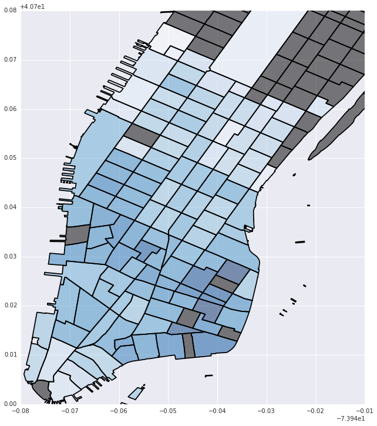
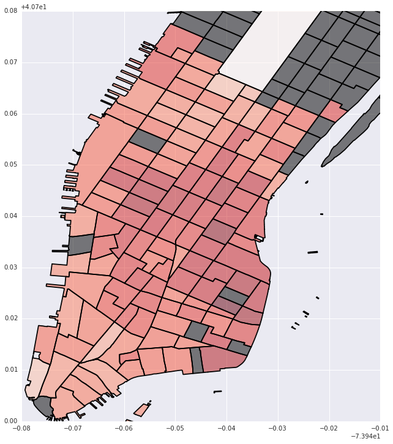
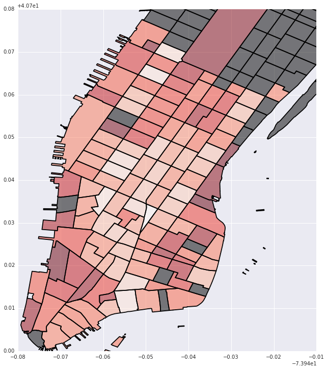

---
redirect_from:
  - "/model/spint/nyc-bike-example"
interact_link: content/model/spint/NYC_Bike_Example.ipynb
kernel_name: Python [Root]
has_widgets: false
title: 'NYC_Bike_Example'
prev_page:
  url: /model/spint/autograd_test
  title: 'autograd_test'
next_page:
  url: /model/spint/4d_distance
  title: '4d_distance'
comment: "***PROGRAMMATICALLY GENERATED, DO NOT EDIT. SEE ORIGINAL FILES IN /content***"
---


<div markdown="1" class="cell code_cell">
<div class="input_area" markdown="1">
```python
import os
os.chdir('../')
from gravity import Gravity, Production, Attraction, Doubly
os.chdir('/Users/toshan/dev/pysal/pysal/contrib/spint')
import entropy as grav
import numpy as np
import scipy.stats as stats
import pandas as pd
import seaborn as sns
import geopandas as gp
os.chdir('/Users/toshan/Dropbox/Data/NYC_BIKES')
import matplotlib.pylab as plt
%pylab inline
from descartes import PolygonPatch
import matplotlib as mpl
from mpl_toolkits.basemap import Basemap
import pyproj as pj
from shapely.geometry import Polygon, Point


```
</div>

<div class="output_wrapper" markdown="1">
<div class="output_subarea" markdown="1">
{:.output_stream}
```
Populating the interactive namespace from numpy and matplotlib
```
</div>
</div>
</div>


<div markdown="1" class="cell code_cell">
<div class="input_area" markdown="1">
```python
ct = pd.read_csv('CT_BIKE_DATA.csv')
ct = ct[ct['o_tract'] != ct['d_tract']]

ct.ix[ct.o_sq_foot == 0, 'o_sq_foot'] = 1
ct.ix[ct.d_sq_foot == 0, 'd_sq_foot'] = 1
ct.ix[ct.o_cap == 0, 'o_cap'] = 1
ct.ix[ct.d_cap == 0, 'd_cap'] = 1
ct.ix[ct.o_housing == 0, 'o_housing'] = 1
ct.ix[ct.d_housing == 0, 'd_housing'] = 1

flows = ct['count'].values.reshape((-1,1))
o_vars = np.hstack([ct['o_sq_foot'].values.reshape((-1,1)), ct['o_housing'].values.reshape((-1,1)), ct['o_cap'].values.reshape((-1,1))])
d_vars = np.hstack([ct['d_sq_foot'].values.reshape((-1,1)), ct['d_housing'].values.reshape((-1,1)), ct['d_cap'].values.reshape((-1,1))])
cost = ct['tripduration'].values.reshape((-1,1))
o = ct['o_tract'].astype(str).values.reshape((-1,1))
d = ct['d_tract'].astype(str).values.reshape((-1,1))
print len(ct), ' OD pairs between census tracts after filtering out intrazonal flows'
ct.head()


```
</div>

<div class="output_wrapper" markdown="1">
<div class="output_subarea" markdown="1">
{:.output_stream}
```
14042  OD pairs between census tracts after filtering out intrazonal flows
```
</div>
</div>
<div class="output_wrapper" markdown="1">
<div class="output_subarea" markdown="1">


<div markdown="0" class="output output_html">
<div style="max-height:1000px;max-width:1500px;overflow:auto;">
<table border="1" class="dataframe">
  <thead>
    <tr style="text-align: right;">
      <th></th>
      <th>Unnamed: 0</th>
      <th>count</th>
      <th>d_cap</th>
      <th>d_tract</th>
      <th>distance</th>
      <th>end station latitude</th>
      <th>end station longitude</th>
      <th>o_cap</th>
      <th>o_tract</th>
      <th>tripduration</th>
      <th>...</th>
      <th>d_sq_foot</th>
      <th>diffs_out</th>
      <th>start</th>
      <th>end</th>
      <th>weighted</th>
      <th>total_out</th>
      <th>total_in</th>
      <th>o_hub</th>
      <th>d_hub</th>
      <th>od_hub</th>
    </tr>
  </thead>
  <tbody>
    <tr>
      <th>0</th>
      <td> 0</td>
      <td> 5709</td>
      <td> 255</td>
      <td> 600</td>
      <td>NaN</td>
      <td> 40.712899</td>
      <td>-73.989865</td>
      <td> 162</td>
      <td>  202</td>
      <td> 474.173605</td>
      <td>...</td>
      <td> 59149181.752643</td>
      <td> 28553756</td>
      <td>  202</td>
      <td> 600</td>
      <td> 0</td>
      <td>  56352</td>
      <td> 69165</td>
      <td> hub</td>
      <td> hub</td>
      <td>     hub</td>
    </tr>
    <tr>
      <th>1</th>
      <td> 1</td>
      <td> 4010</td>
      <td> 595</td>
      <td> 600</td>
      <td>NaN</td>
      <td> 40.712899</td>
      <td>-73.989865</td>
      <td> 774</td>
      <td>  700</td>
      <td> 765.920864</td>
      <td>...</td>
      <td> 59149181.752643</td>
      <td> 28553756</td>
      <td>  700</td>
      <td> 600</td>
      <td> 0</td>
      <td> 160040</td>
      <td> 69165</td>
      <td> hub</td>
      <td> hub</td>
      <td>     hub</td>
    </tr>
    <tr>
      <th>2</th>
      <td> 2</td>
      <td> 1906</td>
      <td> 170</td>
      <td> 600</td>
      <td>NaN</td>
      <td> 40.712899</td>
      <td>-73.989865</td>
      <td> 141</td>
      <td>  800</td>
      <td> 395.842085</td>
      <td>...</td>
      <td> 59149181.752643</td>
      <td> 28553756</td>
      <td>  800</td>
      <td> 600</td>
      <td> 0</td>
      <td>  34254</td>
      <td> 69165</td>
      <td> hub</td>
      <td> hub</td>
      <td> non_hub</td>
    </tr>
    <tr>
      <th>3</th>
      <td> 3</td>
      <td> 1192</td>
      <td> 255</td>
      <td> 600</td>
      <td>NaN</td>
      <td> 40.712899</td>
      <td>-73.989865</td>
      <td> 291</td>
      <td>  900</td>
      <td> 882.062412</td>
      <td>...</td>
      <td> 59149181.752643</td>
      <td> 28553756</td>
      <td>  900</td>
      <td> 600</td>
      <td> 0</td>
      <td>  46446</td>
      <td> 69165</td>
      <td> hub</td>
      <td> hub</td>
      <td> non_hub</td>
    </tr>
    <tr>
      <th>4</th>
      <td> 4</td>
      <td>  484</td>
      <td>  85</td>
      <td> 600</td>
      <td>NaN</td>
      <td> 40.712899</td>
      <td>-73.989865</td>
      <td>  57</td>
      <td> 1002</td>
      <td> 767.284951</td>
      <td>...</td>
      <td> 59149181.752643</td>
      <td> 28553756</td>
      <td> 1002</td>
      <td> 600</td>
      <td> 0</td>
      <td>  15916</td>
      <td> 69165</td>
      <td> hub</td>
      <td> hub</td>
      <td> non_hub</td>
    </tr>
  </tbody>
</table>
<p>5 rows × 27 columns</p>
</div>
</div>


</div>
</div>
</div>


<div markdown="1" class="cell code_cell">
<div class="input_area" markdown="1">
```python
os.chdir('/Users/toshan/dev/pysal/pysal/contrib/spint')
from gravity import Gravity, Production, Attraction, Doubly

model = Gravity(flows, o_vars, d_vars, cost, 'exp')
print model.params
print model.deviance

```
</div>

<div class="output_wrapper" markdown="1">
<div class="output_subarea" markdown="1">
{:.output_stream}
```
[ 0.09898099  0.05748786  0.50319944  0.06920194  0.06408526  0.39371417
 -0.00226671]
3289243.68953
```
</div>
</div>
</div>


<div markdown="1" class="cell code_cell">
<div class="input_area" markdown="1">
```python
model = Production(flows, o, d_vars, cost, 'exp')
print model.params[-4:]
print model.deviance

```
</div>

<div class="output_wrapper" markdown="1">
<div class="output_subarea" markdown="1">
{:.output_stream}
```
[ 0.00437122  0.06794379  0.85720958 -0.00227555]
2383227.55076
```
</div>
</div>
</div>


<div markdown="1" class="cell code_cell">
<div class="input_area" markdown="1">
```python
model = Doubly(flows, o, d, cost, 'exp')
print model.params[-1]
print model.deviance

```
</div>

<div class="output_wrapper" markdown="1">
<div class="output_subarea" markdown="1">
{:.output_stream}
```
-0.00232112445583
1444734.46276
```
</div>
</div>
</div>


<div markdown="1" class="cell code_cell">
<div class="input_area" markdown="1">
```python
model = Production(flows, o, d_vars, cost, 'exp')
local = model.local()

```
</div>

</div>


<div markdown="1" class="cell code_cell">
<div class="input_area" markdown="1">
```python
local['param4'][:10]

```
</div>

<div class="output_wrapper" markdown="1">
<div class="output_subarea" markdown="1">


{:.output_data_text}
```
[-0.0017795992298777902,
 -0.0026156676327248746,
 -0.0022363993586345388,
 -0.00194947666943137,
 -0.0017071540350527339,
 -0.0019515685319320963,
 -0.0016810426792857047,
 -0.0017657944972518311,
 -0.0020341925723913884,
 -0.0015759200833807205]
```


</div>
</div>
</div>


<div markdown="1" class="cell code_cell">
<div class="input_area" markdown="1">
```python
model.params[-1:] - local['param4']

```
</div>

<div class="output_wrapper" markdown="1">
<div class="output_subarea" markdown="1">


{:.output_data_text}
```
array([ -4.95948156e-04,   3.40120247e-04,  -3.91480275e-05,
        -3.26070717e-04,  -5.68393351e-04,  -3.23978854e-04,
        -5.94504707e-04,  -5.09752889e-04,  -2.41354814e-04,
        -6.99627303e-04,  -6.06703481e-04,  -2.87165103e-04,
        -2.06833527e-04,  -7.12588916e-04,   5.04928141e-06,
         5.34234751e-04,  -1.23411275e-04,  -1.59568001e-04,
        -2.96358867e-04,  -8.13853592e-04,  -5.58786311e-04,
        -1.53686724e-04,   1.52269287e-04,  -5.62449153e-04,
        -4.99537030e-04,  -1.98040148e-04,   9.82797486e-04,
        -8.67929860e-04,  -5.27493938e-04,  -9.24817442e-04,
        -2.45312465e-04,  -1.16812380e-04,  -1.02053526e-03,
         1.67786401e-04,   3.41493881e-04,   4.59007938e-04,
         8.02955033e-04,   2.43489411e-04,   1.10776816e-03,
         8.55636181e-04,  -1.29914342e-04,   5.03848977e-04,
         8.70868120e-04,   5.28052058e-04,   1.09964551e-03,
         2.88481182e-04,   3.95290078e-04,   7.13678425e-04,
         6.20446122e-05,  -1.46495796e-04,  -2.73198728e-04,
         9.14219582e-04,   3.19989141e-04,   3.02280808e-04,
         4.41425231e-04,   4.36411583e-04,   3.47806100e-05,
         3.49817242e-04,   2.02926954e-04,   1.61125584e-04,
        -1.37626107e-04,   3.14375309e-04,   2.71524960e-04,
         2.57004947e-04,   5.06773514e-05,   1.41876242e-04,
        -9.54660826e-05,   7.85559253e-05,   1.04857127e-04,
        -1.22876232e-04,  -3.72755027e-05,   2.21322945e-04,
         5.30628729e-04,   2.60089456e-05,   3.44939369e-04,
        -2.03039191e-04,   8.70161481e-04,   5.93617124e-04,
         2.20113262e-05,   2.28752154e-04,   1.70450009e-05,
         4.31890011e-04,  -1.63104457e-04,   5.46943635e-04,
        -1.79543169e-04,   4.17203373e-04,  -8.31555539e-05,
         4.56660548e-04,  -4.73247746e-04,   1.91977621e-04,
         6.35081811e-04,   1.23280773e-04,   4.13098476e-04,
         6.17848610e-05,   5.71604649e-05,   4.84527935e-04,
        -3.04029156e-04,   2.82207361e-04,   4.09784527e-04,
        -4.02865802e-04,   3.82267728e-04,  -5.74829501e-04,
         4.00848442e-04,  -5.56075560e-05,  -8.41775681e-04,
         3.21238255e-04,  -3.94157736e-04,   5.70250598e-04,
        -6.58632949e-04,  -3.50101571e-04,   3.52107030e-04,
        -3.79342620e-04,   4.12304788e-04,  -8.41623629e-04,
         2.55518204e-04,  -2.47800511e-04,   4.01094216e-04,
        -3.52907394e-04,   4.74670899e-05])
```


</div>
</div>
</div>


<div markdown="1" class="cell code_cell">
<div class="input_area" markdown="1">
```python
crs = {'datum':'WGS84', 'proj':'longlat'}
tracts = gp.read_file('/Users/toshan/Dropbox/Data/NYC_BIKES/nyct2010_15a/nyct2010.shp')
tracts = tracts.to_crs(crs=crs)
man_tracts = tracts[tracts['BoroCode'] == '1'].copy()
man_tracts['CT2010S'] = man_tracts['CT2010'].astype(int).astype(str)
mt = set(man_tracts.CT2010S.unique())
lt = set(np.unique(o))
nt = list(mt.difference(lt))
no_tracts = pd.DataFrame({'no_tract':nt})
no_tracts = man_tracts[man_tracts.CT2010S.isin(nt)].copy()
local_vals = pd.DataFrame({'betas': local['param4'], 'tract':np.unique(o)})
local_vals = pd.merge(local_vals, man_tracts[['CT2010S', 'geometry']], left_on='tract', right_on='CT2010S')
local_vals = gp.GeoDataFrame(local_vals)


```
</div>

</div>


<div markdown="1" class="cell code_cell">
<div class="input_area" markdown="1">
```python
plt.figure(figsize=(12,12))
local_vals['inv_betas'] = (local_vals['betas']*-1)
no_tracts['test'] = 0
no_tracts.plot('test', colormap='copper')
local_vals.plot('inv_betas', colormap='Blues')
plt.xlim(-74.02, -73.95)
plt.ylim(40.7, 40.78)

```
</div>

<div class="output_wrapper" markdown="1">
<div class="output_subarea" markdown="1">


{:.output_data_text}
```
(40.7, 40.78)
```


</div>
</div>
<div class="output_wrapper" markdown="1">
<div class="output_subarea" markdown="1">

{:.output_png}


</div>
</div>
</div>


<div markdown="1" class="cell code_cell">
<div class="input_area" markdown="1">
```python
plt.figure(figsize=(12,12))
local_vals['cap'] = local['param3']
no_tracts['test'] = 0
no_tracts.plot('test', colormap='copper')
local_vals.plot('cap', colormap='Reds')
plt.legend()
plt.xlim(-74.02, -73.95)
plt.ylim(40.7, 40.78)

```
</div>

<div class="output_wrapper" markdown="1">
<div class="output_subarea" markdown="1">


{:.output_data_text}
```
(40.7, 40.78)
```


</div>
</div>
<div class="output_wrapper" markdown="1">
<div class="output_subarea" markdown="1">

{:.output_png}


</div>
</div>
</div>


<div markdown="1" class="cell code_cell">
<div class="input_area" markdown="1">
```python
plt.figure(figsize=(12,12))
local_vals['house'] = local['param2']
no_tracts['test'] = 0
no_tracts.plot('test', colormap='copper')
local_vals.plot('house', colormap='Reds')
plt.legend()
plt.xlim(-74.02, -73.95)
plt.ylim(40.7, 40.78)

```
</div>

<div class="output_wrapper" markdown="1">
<div class="output_subarea" markdown="1">


{:.output_data_text}
```
(40.7, 40.78)
```


</div>
</div>
<div class="output_wrapper" markdown="1">
<div class="output_subarea" markdown="1">

{:.output_png}


</div>
</div>
</div>


<div markdown="1" class="cell code_cell">
<div class="input_area" markdown="1">
```python
plt.figure(figsize=(12,12))
local_vals['foot'] = local['param1']
no_tracts['test'] = 0
no_tracts.plot('test', colormap='copper')
local_vals.plot('foot', colormap='Reds')
plt.legend()
plt.xlim(-74.02, -73.95)
plt.ylim(40.7, 40.78)

```
</div>

<div class="output_wrapper" markdown="1">
<div class="output_subarea" markdown="1">


{:.output_data_text}
```
(40.7, 40.78)
```


</div>
</div>
<div class="output_wrapper" markdown="1">
<div class="output_subarea" markdown="1">

{:.output_png}


</div>
</div>
</div>

