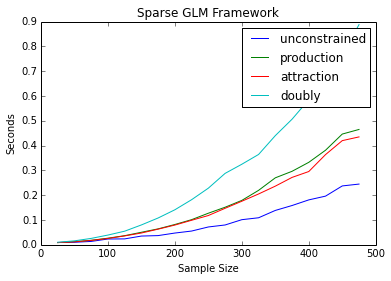

---
redirect_from:
  - "/model/spint/sparse-grav"
interact_link: content/model/spint/sparse_grav.ipynb
title: 'sparse_grav'
prev_page:
  url: /model/spint/sparse_categorical_speed
  title: 'sparse_categorical_speed'
next_page:
  url: /model/spint/sparse_scipy_optim
  title: 'sparse_scipy_optim'
comment: "***PROGRAMMATICALLY GENERATED, DO NOT EDIT. SEE ORIGINAL FILES IN /content***"
---


{:.input_area}
```python
import numpy as np
import pandas as pd
from gravity import Gravity, Production, Attraction, Doubly, BaseGravity
from entropy import Unconstrained, ProductionConstrained, AttractionConstrained, DoublyConstrained
import statsmodels.formula.api as smf
from statsmodels.api import families
import matplotlib.pyplot as plt
%pylab inline

import time                                                

def timeit(method):

    def timed(*args, **kw):
        ts = time.time()
        result = method(*args, **kw)
        te = time.time()
        elapsed = te-ts

        #print '%2.8f sec' % \
              #(elapsed)
        return result, elapsed

    return timed
```


{:.output_stream}
```
Populating the interactive namespace from numpy and matplotlib

```


{:.input_area}
```python
@timeit
def gravity(f ,o, d, o_vars, d_vars, dij, cost='exp', framework='glm'):
    results = Gravity(f, o_vars, d_vars, dij, cost, framework=framework)
    return results
    
@timeit    
def production(f ,o, d, o_vars, d_vars, dij, cost='exp', framework='glm'):
    results = Production(f, o, d_vars, dij, 'exp', framework=framework)
    return results

@timeit    
def attraction(f ,o, d, o_vars, d_vars, dij, cost='exp', framework='glm'):
    results = Attraction(f, d, o_vars, dij, 'exp', framework=framework)
    return results

@timeit    
def doubly(f ,o, d, o_vars, d_vars, dij, cost='exp', framework='glm'):
    results = Doubly(f, o, d, dij, 'exp', framework=framework)
    return results


```


{:.input_area}
```python
def sim_data(n):
    o = np.tile(np.arange(n),n)
    d = np.repeat(np.arange(n),n)
    loc_size = np.random.randint(25000,500000, n)
    o_vars = np.tile(loc_size, n)
    d_vars = np.repeat(loc_size, n)
    dij = np.random.exponential(2500, n**2)
    f = o_vars**.3*d_vars**.4*np.exp(dij*-.00005)
    o = np.reshape(o, (-1,1))
    d = np.reshape(d, (-1,1))
    o_vars = np.reshape(o_vars, (-1,1))
    d_vars = np.reshape(d_vars, (-1,1))
    dij = np.reshape(dij, (-1,1))
    f = np.reshape(f, (-1,1))
    f = f.astype(np.int64)
    return f, o, d, o_vars, d_vars, dij


```


{:.input_area}
```python
def loop(func, start, stop, step, framework='glm'):
    results = []
    for n in np.arange(start, stop, step):
        f, o, d, o_vars, d_vars, dij = sim_data(n)
        out, elapsed = func(f, o, d, o_vars, d_vars, dij, 'exp', framework=framework)
        print out.params[-2:]
        results.append(elapsed)
    return results
    


```


{:.input_area}
```python
grav = loop(gravity, 25, 500, 25)
prod = loop(production, 25, 500, 25)
att = loop(attraction, 25, 500, 25)
doub = loop(doubly, 25, 500, 25)
```


{:.output_stream}
```
[  4.00004848e-01  -5.00084038e-05]
[  4.00000573e-01  -5.00062538e-05]
[  4.00001709e-01  -5.00054961e-05]
[  4.00001851e-01  -5.00069564e-05]
[  4.00001279e-01  -5.00065682e-05]
[  4.00000901e-01  -5.00061544e-05]
[  4.00001603e-01  -5.00058037e-05]
[  4.00001320e-01  -5.00064304e-05]
[  4.00001404e-01  -5.00056856e-05]
[  4.00001253e-01  -5.00063662e-05]
[  4.00000851e-01  -5.00063702e-05]
[  4.00000984e-01  -5.00059202e-05]
[  4.00001083e-01  -5.00060371e-05]
[  4.00001701e-01  -5.00061038e-05]
[  4.00001469e-01  -5.00061712e-05]
[  4.00001233e-01  -5.00059894e-05]
[  4.00001018e-01  -5.00064219e-05]
[  4.00001447e-01  -5.00059376e-05]
[  4.00001685e-01  -5.00059481e-05]
[  4.00039830e-01  -5.00050274e-05]
[  4.00046796e-01  -5.00056265e-05]
[  4.00044515e-01  -5.00048669e-05]
[  4.00044456e-01  -5.00050570e-05]
[  4.00045157e-01  -5.00052127e-05]
[  4.00042556e-01  -5.00056352e-05]
[  4.00043244e-01  -5.00050025e-05]
[  4.00045189e-01  -5.00051355e-05]
[  4.00045454e-01  -5.00054531e-05]
[  4.00047931e-01  -5.00055669e-05]
[  4.00045333e-01  -5.00056505e-05]
[  4.00046490e-01  -5.00055746e-05]
[  4.00045398e-01  -5.00055018e-05]
[  4.00047206e-01  -5.00056325e-05]
[  4.00048521e-01  -5.00058902e-05]
[  4.00045749e-01  -5.00053913e-05]
[  4.00045288e-01  -5.00056639e-05]
[  4.00044985e-01  -5.00053463e-05]
[  4.00045780e-01  -5.00053808e-05]
[  3.00033188e-01  -5.00072565e-05]
[  3.00032626e-01  -5.00045301e-05]
[  3.00037918e-01  -5.00057608e-05]
[  3.00032697e-01  -5.00054110e-05]
[  3.00034233e-01  -5.00057761e-05]
[  3.00035555e-01  -5.00054497e-05]
[  3.00033197e-01  -5.00057455e-05]
[  3.00034492e-01  -5.00058517e-05]
[  3.00032975e-01  -5.00053805e-05]
[  3.00033378e-01  -5.00054912e-05]
[  3.00033934e-01  -5.00054718e-05]
[  3.00034142e-01  -5.00057332e-05]
[  3.00032985e-01  -5.00055014e-05]
[  3.00032581e-01  -5.00053024e-05]
[  3.00033213e-01  -5.00055054e-05]
[  3.00033148e-01  -5.00054063e-05]
[  3.00034026e-01  -5.00055501e-05]
[  3.00033102e-01  -5.00056106e-05]
[  3.00032262e-01  -5.00053987e-05]
[  7.96718580e+00  -5.00039641e-05]
[  8.76704129e+00  -5.00058576e-05]
[  8.98014242e+00  -5.00059356e-05]
[  7.90481052e+00  -5.00056110e-05]
[  8.78811765e+00  -5.00052879e-05]
[  8.54380348e+00  -5.00053106e-05]
[  8.97843454e+00  -5.00056992e-05]
[  8.52837694e+00  -5.00052285e-05]
[  8.73867401e+00  -5.00055958e-05]
[  9.03798321e+00  -5.00054993e-05]
[  8.70060661e+00  -5.00054254e-05]
[  8.49901168e+00  -5.00054887e-05]
[  8.74020466e+00  -5.00054129e-05]
[  8.92245665e+00  -5.00054691e-05]
[  8.69150733e+00  -5.00053833e-05]
[  8.84487410e+00  -5.00055906e-05]
[  7.93233294e+00  -5.00054770e-05]
[  8.51533586e+00  -5.00055944e-05]
[  8.86541542e+00  -5.00053305e-05]

```


{:.input_area}
```python
grav
```


{:.output_data_text}
```
[0.009379863739013672,
 0.010191917419433594,
 0.013580083847045898,
 0.02336597442626953,
 0.023818016052246094,
 0.03525900840759277,
 0.03714299201965332,
 0.047389984130859375,
 0.055455923080444336,
 0.07191991806030273,
 0.07992720603942871,
 0.10130095481872559,
 0.10898685455322266,
 0.1385822296142578,
 0.15839409828186035,
 0.18109512329101562,
 0.19623899459838867,
 0.2373828887939453,
 0.24484801292419434]
```


{:.input_area}
```python
prod
```


{:.output_data_text}
```
[0.008792877197265625,
 0.012892961502075195,
 0.018072128295898438,
 0.02672410011291504,
 0.036765098571777344,
 0.05049705505371094,
 0.06424093246459961,
 0.08189702033996582,
 0.1013631820678711,
 0.1273641586303711,
 0.15144896507263184,
 0.17901921272277832,
 0.2195439338684082,
 0.2700672149658203,
 0.2963399887084961,
 0.332568883895874,
 0.3813331127166748,
 0.44652509689331055,
 0.4651219844818115]
```


{:.input_area}
```python
att
```


{:.output_data_text}
```
[0.00892496109008789,
 0.01181483268737793,
 0.017676830291748047,
 0.025489091873168945,
 0.03578901290893555,
 0.04750704765319824,
 0.06312990188598633,
 0.07956314086914062,
 0.09888005256652832,
 0.11808300018310547,
 0.14717316627502441,
 0.175645112991333,
 0.20492291450500488,
 0.23653817176818848,
 0.2717468738555908,
 0.2954838275909424,
 0.3636939525604248,
 0.4200310707092285,
 0.43506598472595215]
```


{:.input_area}
```python
doub
```


{:.output_data_text}
```
[0.01020193099975586,
 0.015948057174682617,
 0.025825023651123047,
 0.03924298286437988,
 0.05489301681518555,
 0.08008694648742676,
 0.10814595222473145,
 0.14121484756469727,
 0.18188691139221191,
 0.2283778190612793,
 0.2879500389099121,
 0.3248469829559326,
 0.3642420768737793,
 0.44018101692199707,
 0.506378173828125,
 0.5851249694824219,
 0.6679189205169678,
 0.7664568424224854,
 0.8878300189971924]
```


{:.input_area}
```python
x = np.arange(25, 500, 25)
```


{:.input_area}
```python
plt.plot(x, grav, x, prod, x, att, x, doub)
plt.legend(('unconstrained', 'production', 'attraction', 'doubly'))
plt.title('Sparse GLM Framework')
plt.xlabel('Sample Size')
plt.ylabel('Seconds')
```


{:.output_data_text}
```
<matplotlib.text.Text at 0x10439c9d0>
```




