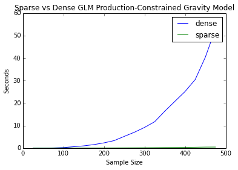
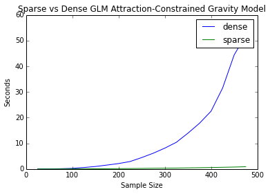
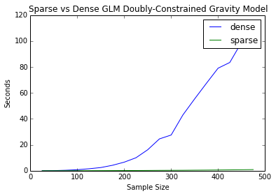

---
redirect_from:
  - "/model/spint/sparse-vs-dense-grav"
interact_link: content/model/spint/sparse_vs_dense_grav.ipynb
title: 'sparse_vs_dense_grav'
prev_page:
  url: /model/spint/intro
  title: 'spint'
next_page:
  url: /model/spint/Example_NYCBikes_AllFeatures
  title: 'Example_NYCBikes_AllFeatures'
comment: "***PROGRAMMATICALLY GENERATED, DO NOT EDIT. SEE ORIGINAL FILES IN /content***"
---


{:.input_area}
```python
import numpy as np
import pandas as pd
from gravity import Gravity, Production, Attraction, Doubly, BaseGravity
from entropy import Unconstrained, ProductionConstrained, AttractionConstrained, DoublyConstrained
import statsmodels.formula.api as smf
from statsmodels.api import families
import matplotlib.pyplot as plt
%pylab inline

import time                                                

def timeit(method):

    def timed(*args, **kw):
        ts = time.time()
        result = method(*args, **kw)
        te = time.time()
        elapsed = te-ts

        #print '%2.8f sec' % \
              #(elapsed)
        return result, elapsed

    return timed
```


{:.output_stream}
```
Populating the interactive namespace from numpy and matplotlib

```


{:.input_area}
```python
@timeit
def gravity(f ,o, d, o_vars, d_vars, dij, cost='exp', framework='glm'):
    results = Gravity(f, o_vars, d_vars, dij, cost, framework=framework)
    return results
    
@timeit    
def production(f ,o, d, o_vars, d_vars, dij, cost='exp', framework='glm'):
    results = Production(f, o, d_vars, dij, 'exp', framework=framework)
    return results

@timeit    
def attraction(f ,o, d, o_vars, d_vars, dij, cost='exp', framework='glm'):
    results = Attraction(f, d, o_vars, dij, 'exp', framework=framework)
    return results

@timeit    
def doubly(f ,o, d, o_vars, d_vars, dij, cost='exp', framework='glm'):
    results = Doubly(f, o, d, dij, 'exp', framework=framework)
    return results


```


{:.input_area}
```python
def sim_data(n):
    o = np.tile(np.arange(n),n)
    d = np.repeat(np.arange(n),n)
    loc_size = np.random.randint(25000,500000, n)
    o_vars = np.tile(loc_size, n)
    d_vars = np.repeat(loc_size, n)
    dij = np.random.exponential(2500, n**2)
    f = o_vars**.3*d_vars**.4*np.exp(dij*-.00005)
    o = np.reshape(o, (-1,1))
    d = np.reshape(d, (-1,1))
    o_vars = np.reshape(o_vars, (-1,1))
    d_vars = np.reshape(d_vars, (-1,1))
    dij = np.reshape(dij, (-1,1))
    f = np.reshape(f, (-1,1))
    f = f.astype(np.int64)
    return f, o, d, o_vars, d_vars, dij


```


{:.input_area}
```python
def loop(func, start, stop, step, framework='glm'):
    results = []
    for n in np.arange(start, stop, step):
        f, o, d, o_vars, d_vars, dij = sim_data(n)
        out, elapsed = func(f, o, d, o_vars, d_vars, dij, 'exp', framework=framework)
        print out.params[-2:]
        results.append(elapsed)
    return results
    


```


{:.input_area}
```python
#copy results over from notebook in sparse branch
sp_grav = np.array([0.009379863739013672,
 0.010191917419433594,
 0.013580083847045898,
 0.02336597442626953,
 0.023818016052246094,
 0.03525900840759277,
 0.03714299201965332,
 0.047389984130859375,
 0.055455923080444336,
 0.07191991806030273,
 0.07992720603942871,
 0.10130095481872559,
 0.10898685455322266,
 0.1385822296142578,
 0.15839409828186035,
 0.18109512329101562,
 0.19623899459838867,
 0.2373828887939453,
 0.24484801292419434])

sp_prod = np.array([0.008792877197265625,
 0.012892961502075195,
 0.018072128295898438,
 0.02672410011291504,
 0.036765098571777344,
 0.05049705505371094,
 0.06424093246459961,
 0.08189702033996582,
 0.1013631820678711,
 0.1273641586303711,
 0.15144896507263184,
 0.17901921272277832,
 0.2195439338684082,
 0.2700672149658203,
 0.2963399887084961,
 0.332568883895874,
 0.3813331127166748,
 0.44652509689331055,
 0.4651219844818115])

sp_att = np.array([0.00892496109008789,
 0.01181483268737793,
 0.017676830291748047,
 0.025489091873168945,
 0.03578901290893555,
 0.04750704765319824,
 0.06312990188598633,
 0.07956314086914062,
 0.09888005256652832,
 0.11808300018310547,
 0.14717316627502441,
 0.175645112991333,
 0.20492291450500488,
 0.23653817176818848,
 0.2717468738555908,
 0.2954838275909424,
 0.3636939525604248,
 0.4200310707092285,
 0.43506598472595215])

sp_doub = np.array([0.01020193099975586,
 0.015948057174682617,
 0.025825023651123047,
 0.03924298286437988,
 0.05489301681518555,
 0.08008694648742676,
 0.10814595222473145,
 0.14121484756469727,
 0.18188691139221191,
 0.2283778190612793,
 0.2879500389099121,
 0.3248469829559326,
 0.3642420768737793,
 0.44018101692199707,
 0.506378173828125,
 0.5851249694824219,
 0.6679189205169678,
 0.7664568424224854,
 0.8878300189971924])
```


{:.input_area}
```python
grav = loop(gravity, 25, 500, 25)
prod = loop(production, 25, 500, 25)
att = loop(attraction, 25, 500, 25)
doub = loop(doubly, 25, 500, 25)
```


{:.output_stream}
```
[  4.00003765e-01  -5.00082127e-05]
[  4.00002697e-01  -5.00066666e-05]
[  3.99999915e-01  -5.00055984e-05]
[  4.00000861e-01  -5.00064292e-05]
[  4.00001140e-01  -5.00063276e-05]
[  4.00001953e-01  -5.00062703e-05]
[  4.00001310e-01  -5.00062954e-05]
[  4.00000599e-01  -5.00060056e-05]
[  4.00001176e-01  -5.00056830e-05]
[  4.00001582e-01  -5.00061861e-05]
[  4.00001745e-01  -5.00066448e-05]
[  4.00001078e-01  -5.00061603e-05]
[  4.00001357e-01  -5.00060119e-05]
[  4.00001380e-01  -5.00057114e-05]
[  4.00001400e-01  -5.00060612e-05]
[  4.00001041e-01  -5.00061054e-05]
[  4.00001420e-01  -5.00061600e-05]
[  4.00001390e-01  -5.00061795e-05]
[  4.00001566e-01  -5.00060298e-05]
[  4.00044504e-01  -5.00046674e-05]
[  4.00045068e-01  -5.00051517e-05]
[  4.00046830e-01  -5.00051536e-05]
[  4.00044189e-01  -5.00051428e-05]
[  4.00047196e-01  -5.00056583e-05]
[  4.00046735e-01  -5.00056823e-05]
[  4.00046318e-01  -5.00055976e-05]
[  4.00047239e-01  -5.00055579e-05]
[  4.00046316e-01  -5.00056376e-05]
[  4.00045989e-01  -5.00051992e-05]
[  4.00044818e-01  -5.00054746e-05]
[  4.00045085e-01  -5.00051760e-05]
[  4.00045998e-01  -5.00054688e-05]
[  4.00045219e-01  -5.00055610e-05]
[  4.00047317e-01  -5.00056556e-05]
[  4.00045808e-01  -5.00055909e-05]
[  4.00045374e-01  -5.00053382e-05]
[  4.00046947e-01  -5.00056095e-05]
[  4.00046361e-01  -5.00056381e-05]
[  3.00034016e-01  -5.00057525e-05]
[  3.00033252e-01  -5.00052744e-05]
[  3.00030145e-01  -5.00053775e-05]
[  3.00030037e-01  -5.00047565e-05]
[  3.00032487e-01  -5.00052466e-05]
[  3.00032907e-01  -5.00052725e-05]
[  3.00033558e-01  -5.00059839e-05]
[  3.00032909e-01  -5.00053619e-05]
[  3.00031875e-01  -5.00051895e-05]
[  3.00032290e-01  -5.00053379e-05]
[  3.00032978e-01  -5.00053514e-05]
[  3.00033905e-01  -5.00054823e-05]
[  3.00031747e-01  -5.00056422e-05]
[  3.00032427e-01  -5.00053723e-05]
[  3.00031778e-01  -5.00052621e-05]
[  3.00034105e-01  -5.00057004e-05]
[  3.00033159e-01  -5.00053856e-05]
[  3.00033450e-01  -5.00056404e-05]
[  3.00032449e-01  -5.00053773e-05]
[  9.05975391e+00  -5.00058173e-05]
[  7.89807159e+00  -5.00052349e-05]
[  8.90961019e+00  -5.00053092e-05]
[  8.65670296e+00  -5.00054583e-05]
[  8.84397080e+00  -5.00052016e-05]
[  8.47393885e+00  -5.00054873e-05]
[  8.29266674e+00  -5.00049815e-05]
[  8.38421867e+00  -5.00060056e-05]
[  8.82217852e+00  -5.00054169e-05]
[  8.88570848e+00  -5.00056774e-05]
[  8.36139835e+00  -5.00054640e-05]
[  8.50520290e+00  -5.00056668e-05]
[  8.93418525e+00  -5.00053669e-05]
[  8.65710610e+00  -5.00055227e-05]
[  7.73443865e+00  -5.00057702e-05]
[  8.63212583e+00  -5.00053614e-05]
[  7.95999344e+00  -5.00053746e-05]
[  8.69617289e+00  -5.00056379e-05]
[  8.54361439e+00  -4.99613448e-05]

```


{:.input_area}
```python
x = np.arange(25, 500, 25)
```


{:.input_area}
```python
plt.plot(x, grav, x, sp_grav)
plt.legend(('dense', 'sparse'))
plt.title('Sparse vs Dense GLM Unconstrained Gravity Model')
plt.xlabel('Sample Size')
plt.ylabel('Seconds')
```


{:.output_data_text}
```
<matplotlib.text.Text at 0x10cf792d0>
```


{:.input_area}
```python
plt.plot(x, prod, x, sp_prod)
plt.legend(('dense', 'sparse'))
plt.title('Sparse vs Dense GLM Production-Constrained Gravity Model')
plt.xlabel('Sample Size')
plt.ylabel('Seconds')
```


{:.output_data_text}
```
<matplotlib.text.Text at 0x10cdc6450>
```





{:.input_area}
```python
plt.plot(x, att, x, sp_att)
plt.legend(('dense', 'sparse'))
plt.title('Sparse vs Dense GLM Attraction-Constrained Gravity Model')
plt.xlabel('Sample Size')
plt.ylabel('Seconds')
```


{:.output_data_text}
```
<matplotlib.text.Text at 0x10d49c410>
```





{:.input_area}
```python
plt.plot(x, doub, x, sp_doub)
plt.legend(('dense', 'sparse'))
plt.title('Sparse vs Dense GLM Doubly-Constrained Gravity Model')
plt.xlabel('Sample Size')
plt.ylabel('Seconds')
```


{:.output_data_text}
```
<matplotlib.text.Text at 0x10d49ce50>
```




