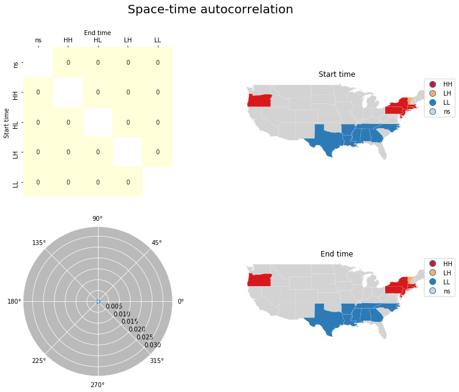

---
redirect_from:
  - "/viz/splot/giddy-space-time"
interact_link: content/viz/splot/giddy_space_time.ipynb
title: 'giddy_space_time'
prev_page:
  url: /viz/splot/esda_moran_matrix_viz
  title: 'esda_moran_matrix_viz'
next_page:
  url: /viz/splot/libpysal_non_planar_joins_viz
  title: 'libpysal_non_planar_joins_viz'
comment: "***PROGRAMMATICALLY GENERATED, DO NOT EDIT. SEE ORIGINAL FILES IN /content***"
---

# Space-time visualisations (giddy)


{:.input_area}
```python
from libpysal.weights.contiguity import Queen
from libpysal import examples
import geopandas as gpd
import pandas as pd
import numpy as np
from giddy.directional import Rose
import matplotlib.pyplot as plt
import esda
from splot.esda import lisa_cluster

from ipywidgets import interact, fixed
import ipywidgets as widgets

%matplotlib inline
```


## Data prepration


{:.input_area}
```python
# get csv and shp and merge
shp_link = examples.get_path('us48.shp')
df = gpd.read_file(shp_link)
income_table = pd.read_csv(examples.get_path("usjoin.csv"))
```


{:.input_area}
```python
# calculate relative values
for year in range(1969, 2010):
    income_table[str(year) + '_rel'] = income_table[str(year)] / income_table[str(year)].mean()
```


{:.input_area}
```python
# merge
gdf = df.merge(income_table,left_on='STATE_NAME',right_on='Name')
```


{:.input_area}
```python
#retrieve spatial weights and data for two points in time
w = Queen.from_dataframe(gdf)
w.transform = 'r'
y1 = gdf['1969_rel'].values
y2 = gdf['2000_rel'].values
```


{:.input_area}
```python
# create rose object
Y = np.array([y1, y2]).T
rose = Rose(Y, w, k=5)
```


{:.input_area}
```python
# calculate Moran_Local
moran_loc1 = esda.moran.Moran_Local(y1, w)
moran_loc2 = esda.moran.Moran_Local(y2, w)
```


## Plotting


{:.input_area}
```python
from splot.giddy import (dynamic_lisa_heatmap,
                         dynamic_lisa_rose,
                         dynamic_lisa_vectors,
                         dynamic_lisa_composite,
                         dynamic_lisa_composite_explore)
import splot

from importlib import reload
reload(splot.giddy)
```


{:.output_data_text}
```
<module 'splot.giddy' from '/Users/steffie/code/splot/splot/giddy.py'>
```


{:.input_area}
```python
fig, ax = dynamic_lisa_heatmap(rose)
ax.set_ylabel(1996)
ax.set_xlabel(2006)
plt.show()
```


{:.input_area}
```python
fig, ax = dynamic_lisa_rose(rose, attribute=y1)
plt.show()
```


{:.input_area}
```python
fig, ax = dynamic_lisa_vectors(rose)
```


{:.input_area}
```python
dynamic_lisa_composite(rose, gdf)
plt.show()
```


{:.input_area}
```python
dynamic_lisa_composite_explore(rose, gdf, pattern='rel')
plt.show()
```




